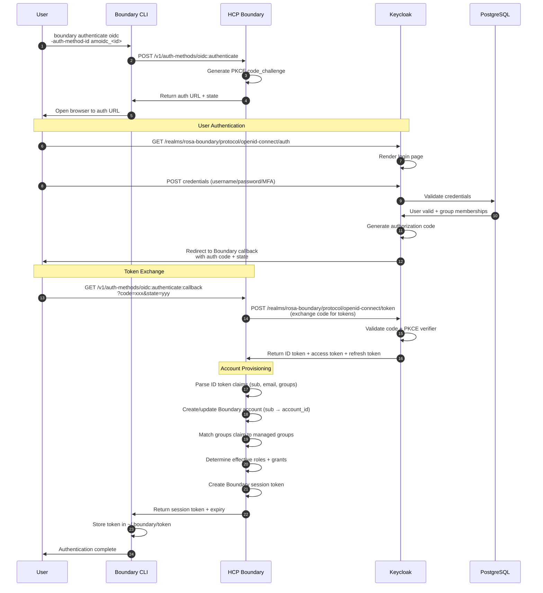
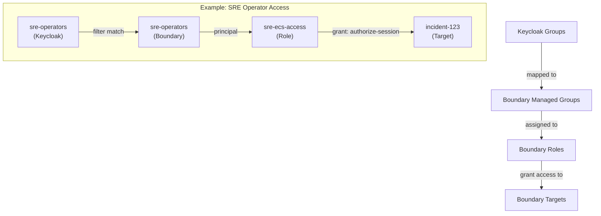
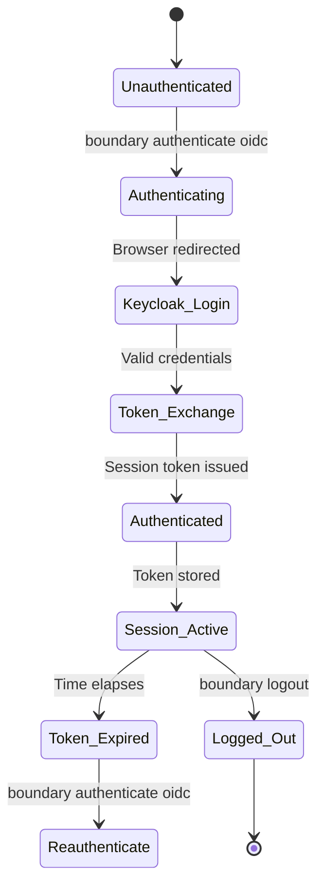

# Authentication Flow

## Overview

User authentication follows the standard OIDC authorization code flow with PKCE, orchestrated between the user's Boundary CLI, HCP Boundary controllers, and Keycloak.

## OIDC Authentication Sequence



## Token Structure

### ID Token (from Keycloak)

```json
{
  "iss": "https://keycloak-keycloak.apps.rosa.dev.dyee.p3.openshiftapps.com/realms/rosa-boundary",
  "sub": "f47ac10b-58cc-4372-a567-0e02b2c3d479",
  "aud": "hcp-boundary",
  "exp": 1704304800,
  "iat": 1704301200,
  "auth_time": 1704301195,
  "email": "user@example.com",
  "email_verified": true,
  "name": "Jane Doe",
  "groups": ["sre-operators", "rosa-prod-access"]
}
```

**Critical Claims:**
- `sub`: Unique user identifier (maps to Boundary account)
- `email`: User email address
- `name`: Display name
- `groups`: Array of Keycloak group memberships (mapped to Boundary managed groups)
- `aud`: Must match Boundary client ID

### Boundary Session Token

```json
{
  "token_id": "at_1234567890",
  "user_id": "u_1234567890",
  "auth_method_id": "amoidc_1234567890",
  "created_time": "2026-01-03T15:00:00Z",
  "expiration_time": "2026-01-04T15:00:00Z",
  "scopes": ["global", "o_1234567890", "p_1234567890"]
}
```

**Scope Hierarchy:**
- `global`: Access to global scope resources
- `o_<id>`: Access to organization scope
- `p_<id>`: Access to project scope (where targets live)

## Managed Group Mapping

Boundary managed groups use filter expressions to match OIDC claims:

| Keycloak Group | Boundary Managed Group | Filter Expression |
|----------------|------------------------|-------------------|
| `sre-admins` | `sre-admins` | `"sre-admins" in "/token/groups"` |
| `sre-operators` | `sre-operators` | `"sre-operators" in "/token/groups"` |
| `sre-viewers` | `sre-viewers` | `"sre-viewers" in "/token/groups"` |

**Filter Evaluation:**
1. Boundary receives ID token from Keycloak
2. Extracts `groups` claim as array
3. Evaluates each managed group filter against `"/token/groups"`
4. User becomes member of matching managed groups
5. Roles grant permissions to managed groups

## Role-Based Access Control (RBAC)



**Grant Strings:**
```hcl
# Allow session authorization on all targets
"ids=*;type=target;actions=authorize-session"

# Allow specific target access
"ids=ttcp_1234567890;type=target;actions=authorize-session,read"
```

## Authentication Lifecycle



**Token Expiry:**
- ID token: Typically 5-60 minutes (Keycloak configured)
- Boundary session: Tied to ID token expiry + max_age setting
- Refresh token: Can extend session without re-authentication (if enabled)

**Best Practices:**
- Set `max_age = 3600` (1 hour) in Boundary auth method to avoid premature expiry
- Use refresh tokens for long-running CLI workflows
- Re-authenticate before critical operations if token is close to expiry

## Security Considerations

### OIDC Security

1. **PKCE (Proof Key for Code Exchange)**: Prevents authorization code interception
2. **State Parameter**: Prevents CSRF attacks on callback
3. **Nonce**: Prevents replay attacks
4. **TLS**: All communication over HTTPS (Keycloak Route edge termination)

### Token Security

1. **ID Token Signature Verification**: Boundary validates RS256 signature using Keycloak public keys (JWKS endpoint)
2. **Audience Validation**: ID token `aud` claim must match Boundary client ID
3. **Issuer Validation**: ID token `iss` claim must match configured issuer
4. **Expiration Checking**: Tokens validated against `exp` and `iat` claims

### Session Security

1. **Token Storage**: Boundary CLI stores tokens in `~/.boundary/token` (file permissions 0600)
2. **No Credential Sharing**: Each user has unique Keycloak credentials
3. **Group-Based Authorization**: Access controlled via Keycloak group membership
4. **Session Timeouts**: Configurable max session duration (default 8 hours for ECS targets)

## Troubleshooting Authentication

Common issues and solutions:

**"auth_time is beyond max_age"**
- Increase `max_age` in Boundary OIDC auth method (default 30s is too short)
- Recommended: `max_age = 3600` (1 hour)

**"invalid signature"**
- Verify Boundary can reach Keycloak JWKS endpoint
- Check clock skew between Boundary and Keycloak
- Verify signing algorithm matches (RS256)

**"groups claim not found"**
- Verify groups protocol mapper is enabled in Keycloak client
- Check claim name is exactly "groups"
- Verify user is member of at least one group

For more troubleshooting, see [Troubleshooting Guide](../runbooks/troubleshooting.md).
