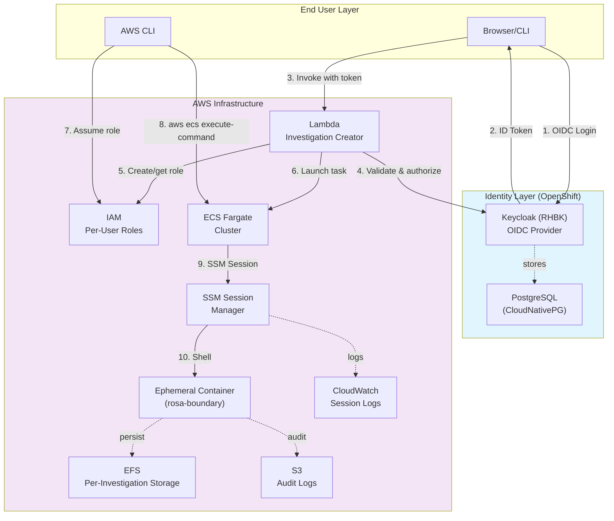
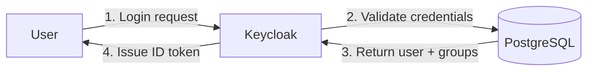
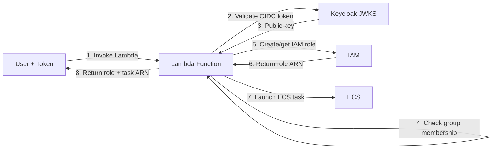
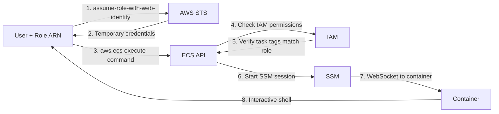
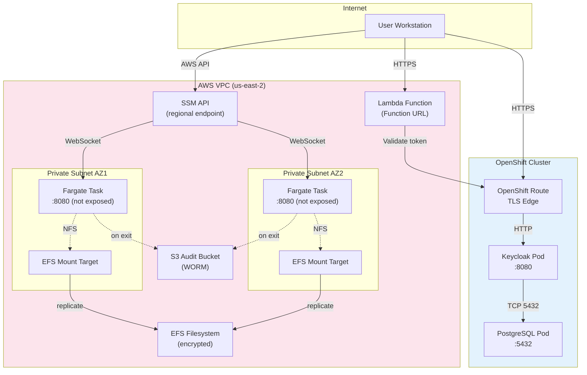
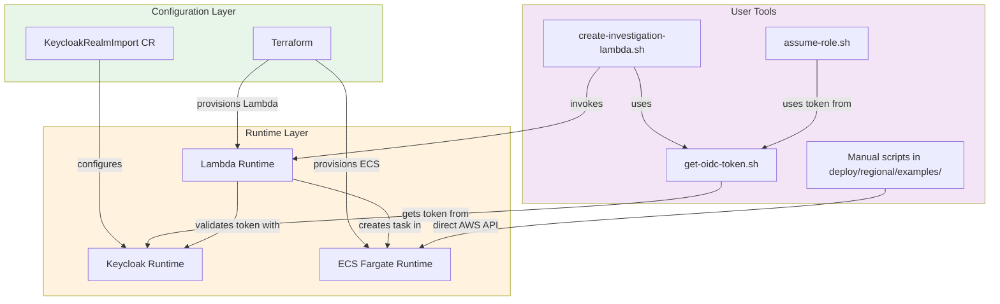

# System Architecture Overview

## Introduction

The ROSA Boundary system implements an access control pattern for ephemeral SRE containers running on AWS ECS Fargate. The architecture consists of two distinct layers that work together to provide secure, audited access to infrastructure.

## High-Level Architecture



## Components

### Identity Layer (Keycloak on OpenShift)

**Keycloak (RHBK v26.4.7)**
- **Purpose**: Identity provider and OIDC authorization server
- **Deployment**: Red Hat build of Keycloak on OpenShift
- **Database**: CloudNativePG PostgreSQL 18.1
- **Namespace**: `keycloak`
- **Access**: https://keycloak-keycloak.apps.rosa.dev.dyee.p3.openshiftapps.com

**Responsibilities:**
- User authentication (username/password, MFA)
- Group membership management (sre-admins, sre-operators, sre-viewers)
- OIDC token issuance (ID token, access token)
- Claims mapping (sub, email, name, groups)

**Key Features:**
- Multi-realm support (rosa-boundary realm)
- Protocol mappers for custom claims
- Integration with external identity providers (LDAP, SAML)
- Persistent storage via CloudNativePG

### AWS Infrastructure Layer

**Lambda Function (Investigation Creator)**
- **Function**: rosa-boundary-{env}-create-investigation
- **Runtime**: Python 3.13
- **Trigger**: Function URL with IAM_OIDC auth
- **Purpose**: OIDC-authenticated investigation creation

**Responsibilities:**
- Validate OIDC token from Keycloak
- Check group membership (sre-team)
- Create or reuse per-user IAM role with tag-based permissions
- Launch ECS task with owner tags
- Return role ARN and task ARN

**ECS Fargate Cluster**
- **Cluster**: rosa-boundary-dev
- **Region**: us-east-2
- **Task Definition**: Per-investigation isolation (rosa-boundary-dev-{cluster}-{investigation}-{timestamp})
- **Container**: rosa-boundary (multi-arch: amd64/arm64)
- **Compute**: 512 CPU / 1024 MB (configurable)

**SSM Session Manager**
- **Protocol**: AWS Systems Manager Session Manager
- **Encryption**: KMS encrypted sessions
- **Authentication**: IAM-based (task role + user IAM)
- **Logging**: CloudWatch Logs `/ecs/rosa-boundary-dev/ssm-sessions`

**EFS Filesystem**
- **Mount**: `/home/sre` in container
- **Access Points**: Per-investigation isolation `/{cluster_id}/{investigation_id}/`
- **Encryption**: At-rest and in-transit
- **POSIX**: uid=1000, gid=1000 (sre user)

**S3 Audit Bucket**
- **Path**: `s3://{bucket}/{cluster}/{investigation}/{date}/{task_id}/`
- **Retention**: 90 days (WORM compliance mode)
- **Sync**: Automatic on container exit via entrypoint signal handling
- **Encryption**: AES256

## Data Flow Layers

### Layer 1: Authentication (Keycloak)



**Outputs:**
- OIDC ID token with claims (sub, email, name, groups)
- Access token for userinfo endpoint
- Refresh token for long-lived sessions

### Layer 2: Authorization (Lambda + IAM)



**Outputs:**
- IAM role ARN (per-user, tag-based permissions)
- ECS task ARN (tagged with username)
- Temporary AWS credentials via assume-role-with-web-identity

### Layer 3: Execution (AWS ECS/SSM)



**Outputs:**
- Interactive terminal session
- CloudWatch session logs
- S3 audit artifacts on exit

## Security Model

### Access Control Principles

1. **Verify Identity**: All users authenticate via Keycloak OIDC (no shared credentials)
2. **Least Privilege**: Lambda validates group membership; IAM enforces tag-based access (only owned tasks)
3. **Assume Breach**: Sessions are ephemeral, isolated per-investigation with audit logs
4. **Explicit Authorization**: Lambda validates group membership before creating investigation
5. **Continuous Monitoring**: All sessions logged to CloudWatch and artifacts synced to S3

### Authentication Chain

```
User Credentials → Keycloak MFA → OIDC Token → Lambda Validation → AWS IAM Role → ECS Exec → Container
```

Every step requires valid credentials/tokens:
- Keycloak validates username/password/MFA
- Lambda validates OIDC token signature and claims
- Lambda checks sre-team group membership
- AWS validates IAM credentials for ECS Exec API
- IAM policy validates task username tag matches role
- SSM validates session encryption keys
- Container enforces `sre` user permissions

### Audit Trail

Every access attempt generates logs in multiple locations:

1. **Keycloak**: Authentication events, login attempts, token issuance
2. **AWS CloudWatch Logs**: Lambda invocations, SSM session I/O, ECS Exec commands, container stdout/stderr
3. **AWS CloudTrail**: API calls (ECS, IAM, Lambda invocations)

Additional artifacts:
- **EFS**: User activity preserved in `/home/sre` per-investigation
- **S3**: Container home directory synced on exit for compliance

## Network Topology



**Network Isolation:**
- Keycloak: OpenShift Routes with edge TLS, internal ClusterIP services
- Lambda: Public Function URL with IAM_OIDC authentication
- Fargate: No ingress, SSM provides egress-only access via AWS PrivateLink

## Per-Investigation Isolation

Each investigation gets dedicated resources:

```
Investigation inv-123 for cluster rosa-prod-01
├── EFS Access Point: /rosa-prod-01/inv-123/
│   └── Mounted to: /home/sre in container
├── Task Definition: rosa-boundary-dev-rosa-prod-01-inv-123-20260103
│   ├── Environment: CLUSTER_ID=rosa-prod-01
│   ├── Environment: INVESTIGATION_ID=inv-123
│   └── Environment: OC_VERSION=4.20
├── IAM Role: rosa-boundary-dev-user-abc123def456 (per OIDC sub claim)
│   ├── Tag-based policy: only access tasks with username=sre-user
│   └── Created/reused by Lambda function
└── S3 Audit Path: s3://bucket/rosa-prod-01/inv-123/20260103/{task-id}/
```

**Isolation Guarantees:**
- Each investigation has dedicated filesystem namespace (EFS access point)
- Each investigation has immutable task definition (version locked)
- Each investigation has unique S3 prefix (audit segregation)
- IAM tag-based policies enforce per-user task access

## Integration Architecture



## Technology Stack

| Layer | Component | Version | Purpose |
|-------|-----------|---------|---------|
| **Identity** | Keycloak | 26.4.7 (RHBK) | OIDC authentication |
| | PostgreSQL | 18.1 (CNPG) | Keycloak database |
| | OpenShift | 4.x (ROSA) | Kubernetes platform |
| **Infrastructure** | AWS Lambda | Python 3.13 | Investigation creation & authorization |
| | IAM | Latest | Per-user roles with tag-based policies |
| | ECS Fargate | Latest | Container orchestration |
| | AWS SSM | Latest | Session management |
| | EFS | Latest | Persistent storage |
| | S3 | Latest | Audit log storage |
| | Terraform | Latest | Infrastructure as code |

## Next Steps

- [Configuration Guides](../configuration/) - Step-by-step setup instructions
- [User Access Guide](../runbooks/user-access-guide.md) - End-user workflow
- [Investigation Workflow](../runbooks/investigation-workflow.md) - Creating and managing investigations
