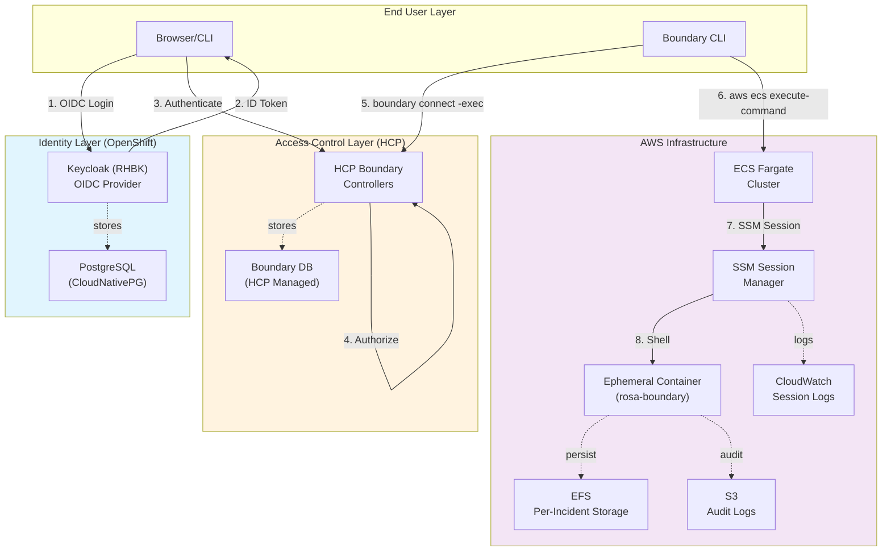
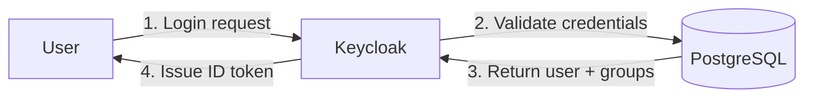
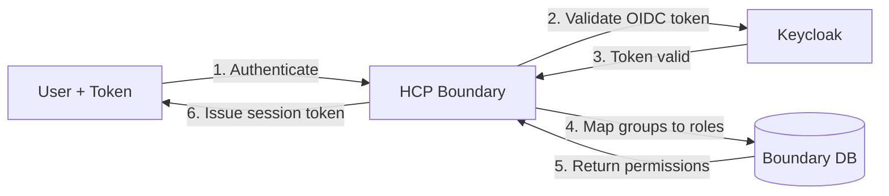
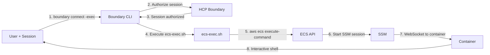
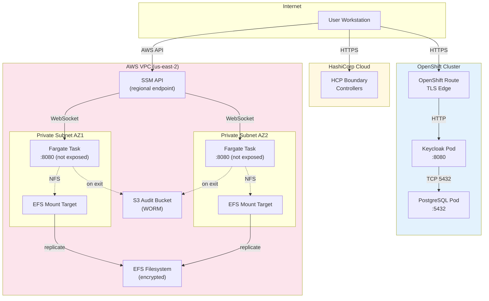
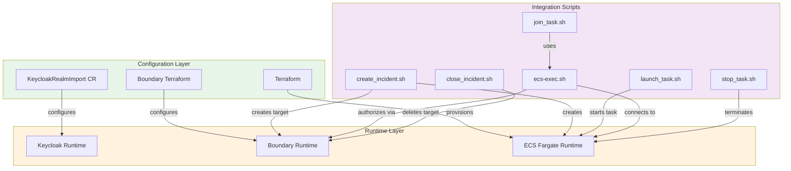

# System Architecture Overview

## Introduction

The ROSA Boundary system implements a zero-trust access pattern for ephemeral SRE containers running on AWS ECS Fargate. The architecture consists of three distinct layers that work together to provide secure, audited access to infrastructure.

## High-Level Architecture



## Components

### Identity Layer (Keycloak on OpenShift)

**Keycloak (RHBK v26.4.7)**
- **Purpose**: Identity provider and OIDC authorization server
- **Deployment**: Red Hat build of Keycloak on OpenShift
- **Database**: CloudNativePG PostgreSQL 18.1
- **Namespace**: `keycloak`
- **Access**: https://keycloak-keycloak.apps.rosa.dev.dyee.p3.openshiftapps.com

**Responsibilities:**
- User authentication (username/password, MFA)
- Group membership management (sre-admins, sre-operators, sre-viewers)
- OIDC token issuance (ID token, access token)
- Claims mapping (sub, email, name, groups)

**Key Features:**
- Multi-realm support (rosa-boundary realm)
- Protocol mappers for custom claims
- Integration with external identity providers (LDAP, SAML)
- Persistent storage via CloudNativePG

### Access Control Layer (HCP Boundary)

**HCP Boundary**
- **Purpose**: Access control and session management
- **Deployment**: HashiCorp Cloud Platform (SaaS)
- **Authentication**: OIDC via Keycloak
- **Database**: Managed by HashiCorp

**Responsibilities:**
- OIDC authentication flow orchestration
- Role-based access control (RBAC)
- Session authorization and lifecycle management
- Audit logging of all access attempts
- Managed group filtering from OIDC claims

**Key Features:**
- Global scope for OIDC auth method
- Project scopes for target organization
- Managed groups synced from Keycloak groups
- Target-based access control
- Session recording metadata

### AWS Infrastructure Layer

**ECS Fargate Cluster**
- **Cluster**: rosa-boundary-dev
- **Region**: us-east-2
- **Task Definition**: Per-incident isolation (rosa-boundary-dev-{cluster}-{incident}-{timestamp})
- **Container**: rosa-boundary (multi-arch: amd64/arm64)
- **Compute**: 512 CPU / 1024 MB (configurable)

**SSM Session Manager**
- **Protocol**: AWS Systems Manager Session Manager
- **Encryption**: KMS encrypted sessions
- **Authentication**: IAM-based (task role + user IAM)
- **Logging**: CloudWatch Logs `/ecs/rosa-boundary-dev/ssm-sessions`

**EFS Filesystem**
- **Mount**: `/home/sre` in container
- **Access Points**: Per-incident isolation `/{cluster_id}/{incident_number}/`
- **Encryption**: At-rest and in-transit
- **POSIX**: uid=1000, gid=1000 (sre user)

**S3 Audit Bucket**
- **Path**: `s3://{bucket}/{cluster}/{incident}/{date}/{task_id}/`
- **Retention**: 90 days (WORM compliance mode)
- **Sync**: Automatic on container exit via entrypoint signal handling
- **Encryption**: AES256

## Data Flow Layers

### Layer 1: Authentication (Keycloak)



**Outputs:**
- OIDC ID token with claims (sub, email, name, groups)
- Access token for userinfo endpoint
- Refresh token for long-lived sessions

### Layer 2: Authorization (Boundary)



**Outputs:**
- Boundary session token (scoped to user + permissions)
- Managed group memberships
- Available targets based on grants

### Layer 3: Execution (AWS ECS/SSM)



**Outputs:**
- Interactive terminal session
- CloudWatch session logs
- S3 audit artifacts on exit

## Security Model

### Zero-Trust Principles

1. **Verify Identity**: All users authenticate via Keycloak OIDC (no shared credentials)
2. **Least Privilege**: Boundary enforces role-based access (only authorized targets)
3. **Assume Breach**: Sessions are ephemeral, isolated per-incident with audit logs
4. **Explicit Authorization**: Every session requires Boundary approval
5. **Continuous Monitoring**: All sessions logged to CloudWatch and audited in Boundary

### Authentication Chain

```
User Credentials → Keycloak MFA → OIDC Token → Boundary Session → AWS IAM → ECS Exec → Container
```

Every step requires valid credentials/tokens:
- Keycloak validates username/password/MFA
- Boundary validates OIDC token signature and claims
- AWS validates IAM credentials for ECS Exec API
- SSM validates session encryption keys
- Container enforces `sre` user permissions

### Audit Trail

Every access attempt generates logs in three locations:

1. **Keycloak**: Authentication events, login attempts, token issuance
2. **Boundary**: Session authorization, connection attempts, session lifecycle
3. **AWS CloudWatch**: SSM session I/O, ECS Exec commands, container stdout/stderr

Additional artifacts:
- **EFS**: User activity preserved in `/home/sre` per-incident
- **S3**: Container home directory synced on exit for compliance

## Network Topology



**Network Isolation:**
- Keycloak: OpenShift Routes with edge TLS, internal ClusterIP services
- Boundary: HCP managed, no network dependencies on AWS
- Fargate: No ingress, SSM provides egress-only access via AWS PrivateLink

## Per-Incident Isolation

Each incident gets dedicated resources:

```
Incident #123 for cluster rosa-prod-01
├── EFS Access Point: /rosa-prod-01/123/
│   └── Mounted to: /home/sre in container
├── Task Definition: rosa-boundary-dev-rosa-prod-01-123-20260103
│   ├── Environment: CLUSTER_ID=rosa-prod-01
│   ├── Environment: INCIDENT_NUMBER=123
│   └── Environment: OC_VERSION=4.20
├── Boundary Target: rosa-prod-01-incident-123
│   ├── Authorization: sre-operators group
│   └── Session: max 8 hours
└── S3 Audit Path: s3://bucket/rosa-prod-01/123/20260103/{task-id}/
```

**Isolation Guarantees:**
- Each incident has dedicated filesystem namespace (EFS access point)
- Each incident has immutable task definition (version locked)
- Each incident has unique S3 prefix (audit segregation)
- Boundary targets scope access per-incident

## Integration Architecture



## Technology Stack

| Layer | Component | Version | Purpose |
|-------|-----------|---------|---------|
| **Identity** | Keycloak | 26.4.7 (RHBK) | OIDC authentication |
| | PostgreSQL | 18.1 (CNPG) | Keycloak database |
| | OpenShift | 4.x (ROSA) | Kubernetes platform |
| **Access** | HCP Boundary | SaaS | Authorization engine |
| | Terraform | Latest | Boundary configuration |
| **Infrastructure** | ECS Fargate | Latest | Container orchestration |
| | AWS SSM | Latest | Session management |
| | EFS | Latest | Persistent storage |
| | S3 | Latest | Audit log storage |

## Next Steps

- [Authentication Flow](authentication-flow.md) - Detailed OIDC flow between Keycloak and Boundary
- [Session Flow](session-flow.md) - How users connect to containers via Boundary
- [Configuration Guides](../configuration/) - Step-by-step setup instructions
