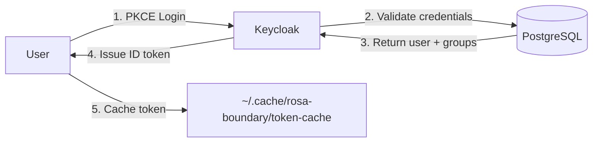
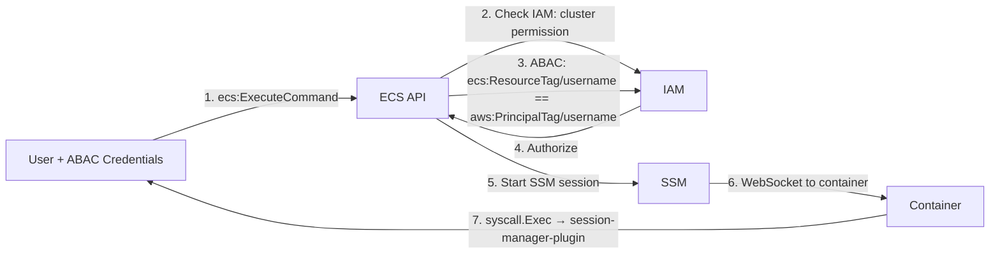
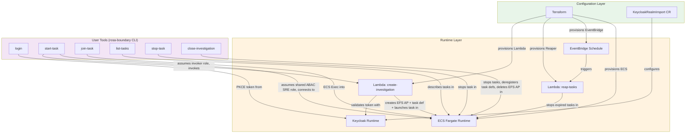

# System Architecture Overview

## Introduction

The ROSA Boundary system implements an access control pattern for ephemeral SRE containers running on AWS ECS Fargate. The architecture consists of two distinct layers that work together to provide secure, audited access to infrastructure.

## High-Level Architecture

```mermaid
flowchart TB
    subgraph User["End User Layer"]
        CLI["rosa-boundary CLI"]
    end

    subgraph Identity["Identity Layer (OpenShift)"]
        KC["Keycloak (RHBK)<br/>OIDC Provider"]
        KCDB["PostgreSQL<br/>(CloudNativePG)"]
    end

    subgraph AWS["AWS Infrastructure"]
        InvokerRole["IAM<br/>Invoker Role"]
        Lambda["Lambda<br/>Investigation Creator"]
        IAM["IAM<br/>Shared ABAC Role"]
        ECS["ECS Fargate<br/>Cluster"]
        SSM["SSM Session<br/>Manager"]
        Fargate["Ephemeral Container<br/>(rosa-boundary)"]
        EFS["EFS<br/>Per-Investigation Storage"]
        S3["S3<br/>Audit Logs"]
        CW["CloudWatch<br/>Session Logs"]
        Reaper["Lambda<br/>Task Reaper"]
        EventBridge["EventBridge<br/>Schedule"]
    end

    CLI -->|1. OIDC Login (PKCE)| KC
    KC -.->|stores| KCDB
    KC -->|2. ID Token| CLI
    CLI -->|3. AssumeRoleWithWebIdentity| InvokerRole
    CLI -->|4. Invoke Lambda (AWS SDK/SigV4)| Lambda
    Lambda -->|5. Validate token via JWKS| KC
    Lambda -->|6. Create EFS AP + launch task| ECS
    Lambda -->|7. Return shared role ARN + task ARN| CLI
    CLI -->|8. AssumeRoleWithWebIdentity (session tags from JWT)| IAM
    CLI -->|9. ecs:ExecuteCommand| ECS
    ECS -->|10. SSM Session| SSM
    SSM -->|11. Shell (syscall.Exec → session-manager-plugin)| Fargate
    Fargate -.->|persist| EFS
    Fargate -.->|audit| S3
    SSM -.->|logs| CW
    EventBridge -->|schedule| Reaper
    Reaper -->|stop expired tasks| ECS

    style Identity fill:#e1f5fe
    style AWS fill:#f3e5f5
```

## Components

### Identity Layer (Keycloak on OpenShift)

**Keycloak (RHBK v26.4.7)**
- **Purpose**: Identity provider and OIDC authorization server
- **Deployment**: Red Hat build of Keycloak on OpenShift
- **Database**: CloudNativePG PostgreSQL 18.1
- **Namespace**: `keycloak`
- **Realm**: `sre-ops`

**Responsibilities:**
- User authentication (username/password, MFA)
- Group membership management (`sre-team`)
- OIDC token issuance (ID token, access token)
- Claims mapping (sub, email, preferred_username, groups)
- Session tag propagation via `https://aws.amazon.com/tags` claim mapper

**Key Features:**
- Protocol mappers for custom claims (including AWS session tags)
- Integration with external identity providers (LDAP, SAML)
- Persistent storage via CloudNativePG

### AWS Infrastructure Layer

**Lambda Function (Investigation Creator)**
- **Function**: `rosa-boundary-{env}-create-investigation`
- **Runtime**: Python 3.11
- **Trigger**: Direct SDK invocation (`lambda:InvokeFunction`) via invoker role
- **Purpose**: OIDC-authenticated investigation creation

**Responsibilities:**
- Validate OIDC token from Keycloak (JWKS signature verification)
- Check `sre-team` group membership
- Create or reuse per-investigation EFS access point
- Register per-investigation task definition with locked EFS mount
- Launch ECS task tagged with `username` and `oidc_sub` for ABAC and audit
- Return shared ABAC SRE role ARN and task ARN

**Lambda Function (Task Reaper)**
- **Function**: `rosa-boundary-{env}-reap-tasks`
- **Runtime**: Python 3.11
- **Trigger**: EventBridge schedule (default: every 15 minutes)
- **Purpose**: Tamper-proof task timeout enforcement

**Responsibilities:**
- List all RUNNING ECS tasks in the cluster
- Parse `deadline` tag (ISO 8601, set at task creation: `created_at + task_timeout`)
- Call `ecs:StopTask` for tasks where `now > deadline`
- Skip tasks without a deadline tag (fail-safe)

**Security Properties (Reaper):**
- Tags are only modifiable via ECS API (IAM permissions not available in container)
- Deadline is computed at task creation and immutable after launch
- Invalid or missing deadline tags are skipped (not treated as expired)

**ECS Fargate Cluster**
- **Cluster**: `rosa-boundary-{env}`
- **Task Definition**: Per-investigation (`rosa-boundary-{env}-{cluster}-{investigation}-{timestamp}`)
- **Container**: `rosa-boundary` (multi-arch: amd64/arm64)
- **Compute**: 512 CPU / 1024 MB (configurable)

**SSM Session Manager**
- **Protocol**: AWS Systems Manager Session Manager
- **Encryption**: KMS encrypted sessions
- **Authentication**: IAM-based (task role + ABAC session tags)
- **Logging**: CloudWatch Logs `/ecs/rosa-boundary-{env}/ssm-sessions`

**EFS Filesystem**
- **Mount**: `/home/sre` in container
- **Access Points**: Per-investigation isolation `/{cluster_id}/{investigation_id}/`
- **Encryption**: At-rest and in-transit
- **POSIX**: uid=1000, gid=1000 (sre user)

**S3 Audit Bucket**
- **Path**: `s3://{bucket}/{cluster}/{investigation}/{date}/{task_id}/`
- **Retention**: 90 days (WORM compliance mode)
- **Sync**: Automatic on container exit via entrypoint signal handling
- **Encryption**: AES256

## Data Flow Layers

### Layer 1: Authentication (Keycloak)

The `rosa-boundary` CLI handles the OIDC PKCE browser flow and caches the token at `~/.cache/rosa-boundary/token-cache`.



**Outputs:**
- OIDC ID token with claims (sub, email, preferred_username, groups)
- Access token for userinfo endpoint
- Refresh token for long-lived sessions

### Layer 2: Authorization (Lambda + IAM)

The CLI uses a two-step role assumption before invoking Lambda. The invoker role gates Lambda access; the shared SRE ABAC role gates ECS Exec access via session tags from the JWT.

```mermaid
flowchart LR
    U[User + Token] -->|1. AssumeRoleWithWebIdentity| InvokerRole[Invoker Role]
    InvokerRole -->|2. Temporary credentials| U
    U -->|3. Invoke Lambda via SDK (SigV4)| Lambda[Lambda Function]
    Lambda -->|4. Validate token via JWKS| KC[Keycloak JWKS]
    KC -->|5. Public key| Lambda
    Lambda -->|6. Check sre-team membership| Lambda
    Lambda -->|7. Create EFS AP + task def + launch task| ECS[ECS]
    Lambda -->|8. Return shared role ARN + task ARN| U
    U -->|9. AssumeRoleWithWebIdentity (session tags from JWT)| SRERole[Shared ABAC SRE Role]
    SRERole -->|10. Credentials with session tags| U
```

**Outputs:**
- Shared ABAC SRE role credentials (session-tagged with `username` from JWT)
- ECS task ARN (task tagged with `username` and `oidc_sub`)
- EFS access point ID

### Layer 3: Execution (AWS ECS/SSM)



The CLI replaces its own process with `session-manager-plugin` via `syscall.Exec`, providing a seamless terminal handoff with no intermediate wrapper process.

**Outputs:**
- Interactive terminal session
- CloudWatch session logs
- S3 audit artifacts on exit

## Security Model

### Access Control Principles

1. **Verify Identity**: All users authenticate via Keycloak OIDC (no shared credentials)
2. **Least Privilege**: Lambda validates group membership; shared ABAC role enforces per-user task isolation via session tags — no per-user IAM roles required
3. **Assume Breach**: Sessions are ephemeral, isolated per-investigation with audit logs
4. **Explicit Authorization**: Lambda validates group membership before creating investigation
5. **Continuous Monitoring**: All sessions logged to CloudWatch and artifacts synced to S3

### Authentication Chain

```
User Credentials → Keycloak MFA → OIDC Token → Assume Invoker Role → Lambda Validation → Assume Shared ABAC SRE Role (session tags) → ECS Exec (ABAC enforced) → Container
```

Every step requires valid credentials/tokens:
- Keycloak validates username/password/MFA
- CLI assumes invoker role via `AssumeRoleWithWebIdentity` (gates Lambda access)
- Lambda validates OIDC token signature and claims
- Lambda checks `sre-team` group membership
- CLI assumes shared SRE role with JWT session tags (`username`, `oidc_sub`)
- IAM ABAC policy: `ecs:ResourceTag/username` must match `aws:PrincipalTag/username`
- SSM validates session encryption keys
- Container enforces `sre` user permissions

### ABAC Isolation Model

All SREs assume a single shared role (`sre_role_arn`). Cross-user isolation is enforced at the AWS API layer via Attribute-Based Access Control (ABAC):

- **Session tags**: Keycloak propagates `username` via the `https://aws.amazon.com/tags` claim mapper. AWS STS automatically converts this to a session tag during `AssumeRoleWithWebIdentity`.
- **Task tags**: The create-investigation Lambda tags each task with `username` (the SRE's `preferred_username`).
- **ABAC condition**: The shared role's permissions policy requires `ecs:ResourceTag/username == ${aws:PrincipalTag/username}`.

**Fail-closed properties:**
- Missing session tag → no `PrincipalTag` → condition fails → deny
- Untagged task → missing `ResourceTag` → condition fails → deny
- Tag values come from the OIDC JWT, not user-controlled input

**Two-statement ECS Exec policy** (required because `ecs:ExecuteCommand` needs permissions on both cluster and task resources):
- `ExecuteCommandOnCluster`: cluster-level permission, no condition (all SREs pass)
- `ExecuteCommandOnOwnedTasks`: task-level permission, ABAC condition on `username` tag

### Task Timeout Enforcement

The reaper Lambda provides tamper-proof enforcement of task deadlines:
- Deadline computed at task creation: `created_at + task_timeout` (ISO 8601, stored as ECS task tag)
- ECS task tags are not modifiable from within the container (IAM-gated)
- Reaper runs every 15 minutes (configurable); calls `ecs:StopTask` for expired tasks
- Tasks without a deadline tag are skipped (no forced termination)

### Audit Trail

Every access attempt generates logs in multiple locations:

1. **Keycloak**: Authentication events, login attempts, token issuance
2. **AWS CloudWatch Logs**: Lambda invocations, SSM session I/O, ECS Exec commands, container stdout/stderr
3. **AWS CloudTrail**: API calls (ECS, IAM, Lambda invocations)

Additional artifacts:
- **EFS**: User activity preserved in `/home/sre` per-investigation
- **S3**: Container home directory synced on exit for compliance

## Network Topology

```mermaid
flowchart TB
    subgraph Internet["Internet"]
        User["User Workstation<br/>(rosa-boundary CLI)"]
    end

    subgraph OpenShift["OpenShift Cluster"]
        KC["Keycloak Pod<br/>:8080"]
        KCDB["PostgreSQL Pod<br/>:5432"]
        Route["OpenShift Route<br/>TLS Edge"]
    end

    subgraph AWS["AWS VPC"]
        Lambda["Lambda Function<br/>(SDK invocation)"]
        Reaper["Lambda Function<br/>(Task Reaper)"]
        EventBridge["EventBridge<br/>Schedule"]
        subgraph Subnet1["Private Subnet AZ1"]
            Fargate1["Fargate Task<br/>:8080 (not exposed)"]
            EFS1["EFS Mount Target"]
        end
        subgraph Subnet2["Private Subnet AZ2"]
            Fargate2["Fargate Task<br/>:8080 (not exposed)"]
            EFS2["EFS Mount Target"]
        end
        EFS["EFS Filesystem<br/>(encrypted)"]
        S3["S3 Audit Bucket<br/>(WORM)"]
        SSM["SSM API<br/>(regional endpoint)"]
    end

    User -->|HTTPS (PKCE)| Route
    User -->|AWS SDK (SigV4)| Lambda
    User -->|AWS API| SSM
    Route -->|HTTP| KC
    KC -->|TCP 5432| KCDB
    Lambda -->|Validate token (JWKS)| Route
    EventBridge -->|schedule| Reaper
    Reaper -->|ecs:StopTask| Fargate1
    Reaper -->|ecs:StopTask| Fargate2
    Fargate1 -.->|NFS| EFS1
    Fargate2 -.->|NFS| EFS2
    EFS1 -->|replicate| EFS
    EFS2 -->|replicate| EFS
    Fargate1 -.->|on exit| S3
    Fargate2 -.->|on exit| S3
    SSM -->|WebSocket| Fargate1
    SSM -->|WebSocket| Fargate2

    style OpenShift fill:#e3f2fd
    style AWS fill:#fce4ec
```

**Network Isolation:**
- Keycloak: OpenShift Routes with edge TLS, internal ClusterIP services
- Lambda: Invoked via AWS SDK (`lambda:InvokeFunction`), gated by IAM invoker role
- Fargate: No ingress, SSM provides egress-only access via AWS PrivateLink

## Per-Investigation Isolation

Each investigation gets dedicated resources:

```
Investigation inv-123 for cluster rosa-prod-01
├── EFS Access Point: /rosa-prod-01/inv-123/
│   └── Mounted to: /home/sre in container
├── Task Definition: rosa-boundary-dev-rosa-prod-01-inv-123-20260103T120000
│   ├── Environment: CLUSTER_ID=rosa-prod-01
│   ├── Environment: INVESTIGATION_ID=inv-123
│   └── Environment: OC_VERSION=4.20
├── Shared ABAC SRE Role: rosa-boundary-dev-sre-shared
│   ├── Session tag: username=sre-user (from Keycloak JWT)
│   └── ABAC condition: ecs:ResourceTag/username == ${aws:PrincipalTag/username}
├── Task Tags: username=sre-user, oidc_sub=<uuid>, deadline=<ISO8601>
│   └── deadline enforced by Reaper Lambda (tamper-proof)
└── S3 Audit Path: s3://bucket/rosa-prod-01/inv-123/20260103/{task-id}/
```

**Isolation Guarantees:**
- Each investigation has a dedicated filesystem namespace (EFS access point)
- Each investigation has an immutable task definition (version locked, EFS mount baked in)
- Each investigation has a unique S3 prefix (audit segregation)
- Shared ABAC role with session tags enforces per-user task access at the AWS API layer
- Task deadlines are enforced by the Reaper Lambda independent of the container

## Integration Architecture



## Technology Stack

| Layer | Component | Version | Purpose |
|-------|-----------|---------|---------|
| **Identity** | Keycloak | 26.4.7 (RHBK) | OIDC authentication |
| | PostgreSQL | 18.1 (CNPG) | Keycloak database |
| | OpenShift | 4.x (ROSA) | Kubernetes platform |
| **Infrastructure** | AWS Lambda | Python 3.11 | Investigation creation & authorization |
| | AWS Lambda | Python 3.11 | Task timeout enforcement (Reaper) |
| | IAM | — | Shared ABAC role with session-tag policies |
| | EventBridge | — | Periodic Reaper Lambda schedule |
| | ECS Fargate | — | Container orchestration |
| | AWS SSM | — | Session management |
| | EFS | — | Persistent storage |
| | S3 | — | Audit log storage |
| | KMS | — | Session encryption |
| **CLI** | rosa-boundary | Go (latest) | SRE workflow automation |
| **IaC** | Terraform | >= 1.5 | Infrastructure as code |
| | AWS Provider | ~> 5.0 | Terraform AWS resources |

## Next Steps

- [Configuration Guides](../configuration/) - Step-by-step setup instructions
- [User Access Guide](../runbooks/user-access-guide.md) - End-user workflow
- [Investigation Workflow](../runbooks/investigation-workflow.md) - Creating and managing investigations
