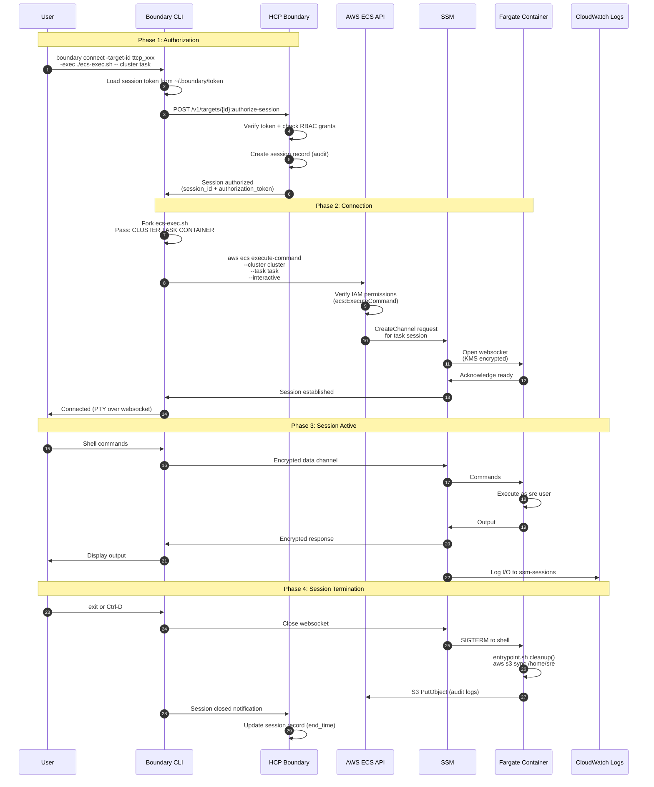
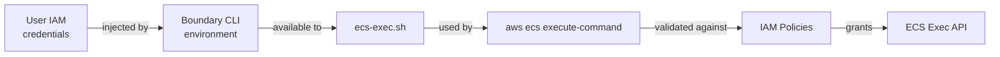

# Session Flow: Boundary to ECS Fargate via SSM

## Overview

This document describes how Boundary sessions connect to ECS Fargate containers using the `-exec` flag to wrap AWS ECS Exec commands. This is a non-standard integration pattern required because HCP Boundary does not natively support ECS containers or SSM Session Manager.

## The -exec Flag Approach

Boundary's `-exec` flag allows wrapping arbitrary commands around TCP session establishment. While Boundary doesn't create a traditional TCP proxy to ECS containers, it:

1. Performs authentication and authorization
2. Creates an audit record of the session
3. Executes a custom script that establishes the actual connection
4. Monitors the process lifecycle

**Key Limitation**: The actual ECS Exec/SSM session is established **outside** Boundary's proxy, so Boundary cannot:
- Intercept or decrypt session traffic
- Enforce network policies on the SSM WebSocket
- Provide true session recording (only metadata)

However, this approach still provides value:
- Centralized authentication (Keycloak)
- Authorization enforcement (Boundary RBAC)
- Audit logging (who accessed what, when)
- Session lifecycle management

## Complete Session Flow



## Detailed Phase Breakdown

### Phase 1: Authorization (Boundary)

**Step 1-2: User initiates connection**
```bash
boundary connect \
  -target-id ttcp_1234567890 \
  -exec ./ecs-exec.sh -- \
  rosa-boundary-dev \
  arn:aws:ecs:us-east-2:xxx:task/rosa-boundary-dev/abc123 \
  rosa-boundary
```

**Step 3-5: Boundary validates and authorizes**
- HCP Boundary checks user's session token
- Evaluates grants: does user have `authorize-session` action on target?
- Creates session record with metadata:
  ```json
  {
    "session_id": "s_1234567890",
    "target_id": "ttcp_1234567890",
    "user_id": "u_abcdefg",
    "auth_method_id": "amoidc_xyz",
    "start_time": "2026-01-03T15:30:00Z",
    "status": "active"
  }
  ```

**Step 6: Authorization token returned**
- Boundary returns session authorization
- CLI receives permission to proceed

### Phase 2: Connection Establishment (AWS)

**Step 7-8: Execute wrapper script**
- Boundary CLI forks `ecs-exec.sh` as child process
- Passes arguments: `CLUSTER`, `TASK`, `CONTAINER`

**Step 9-11: ECS Exec API call**
```bash
aws ecs execute-command \
  --region us-east-2 \
  --cluster rosa-boundary-dev \
  --task arn:aws:ecs:us-east-2:xxx:task/rosa-boundary-dev/abc123 \
  --container rosa-boundary \
  --command "/bin/bash" \
  --interactive
```

**IAM Permissions Checked:**
- `ecs:ExecuteCommand` on task ARN
- `ssm:StartSession` on task ARN
- `kms:GenerateDataKey` on exec session KMS key

**Step 12-14: SSM session establishment**
- ECS calls SSM `CreateControlChannel` and `CreateDataChannel`
- SSM establishes WebSocket connection to Fargate task
- Connection is KMS encrypted end-to-end

### Phase 3: Active Session (SSM)

**Step 15-21: Interactive terminal**
- User input flows: User → Boundary CLI → SSM WebSocket → Container
- Container output flows: Container → SSM WebSocket → Boundary CLI → User
- All I/O logged to CloudWatch: `/ecs/rosa-boundary-dev/ssm-sessions`

**Container environment:**
- Shell runs as `sre` user (uid 1000)
- Home directory: `/home/sre` (EFS mounted, incident-specific)
- Environment variables: `CLUSTER_ID`, `INCIDENT_NUMBER`, `OC_VERSION`, etc.
- Tools: `oc`, `aws`, `claude`, etc.

### Phase 4: Termination and Cleanup (SSM + S3)

**Step 22-24: User exits**
- User types `exit` or presses Ctrl-D
- SSM closes WebSocket
- Container shell receives SIGTERM

**Step 25-27: Entrypoint cleanup**
- `entrypoint.sh` cleanup trap fires
- Syncs `/home/sre` to S3 if `S3_AUDIT_ESCROW` or auto-generated path set:
  ```bash
  aws s3 sync /home/sre/ \
    s3://bucket/cluster-id/incident-num/20260103/task-id/
  ```

**Step 28-29: Boundary session closure**
- Boundary CLI notifies HCP that process exited
- Session record updated with `end_time` and status `terminated`

## Environment Variables in -exec Context

Boundary provides these environment variables to `-exec` scripts:

| Variable | Value | Use Case |
|----------|-------|----------|
| `BOUNDARY_PROXIED_IP` | `127.0.0.1` | Not used (no TCP proxy) |
| `BOUNDARY_PROXIED_PORT` | `9999` | Not used (placeholder) |
| `BOUNDARY_PROXIED_ADDR` | `127.0.0.1:9999` | Not used |

**Additional variables you can pass:**
- Arguments after `--` in `boundary connect` command
- Exported environment variables (AWS credentials, region, etc.)

## Credential Flow



**Options for AWS credentials:**

**Option A: User IAM credentials** (simplest)
- Users configure `~/.aws/credentials` or use SSO
- Boundary CLI inherits credentials from environment
- ecs-exec.sh uses ambient credentials

**Option B: Vault-brokered credentials** (more secure)
- Boundary integrates with Vault
- Vault issues temporary AWS credentials (STS assume-role)
- Credentials injected as environment variables to `-exec` script

**Option C: IRSA (if Boundary workers on EKS)**
- Worker pods have IAM roles via IRSA
- Workers execute `-exec` scripts with pod IAM role
- Requires self-managed workers on Kubernetes

## Session Audit Trail

Every session generates logs in three systems:

### 1. HCP Boundary Session Record

```json
{
  "session_id": "s_1234567890",
  "target_id": "ttcp_1234567890",
  "target_name": "rosa-prod-01-incident-123",
  "user_id": "u_abcdefg",
  "user_email": "jane.doe@example.com",
  "auth_method": "amoidc_xyz (keycloak)",
  "start_time": "2026-01-03T15:30:00Z",
  "end_time": "2026-01-03T17:45:00Z",
  "duration_seconds": 8100,
  "status": "terminated",
  "termination_reason": "closed_by_user"
}
```

### 2. CloudWatch SSM Session Logs

```
/ecs/rosa-boundary-dev/ssm-sessions
└── rosa-boundary/ecs.rosa-boundary-dev.abc123.ecs-execute-command.user.2026-01-03T15.30.00
    ├── [15:30:00] Starting session with SessionId: user-abc123...
    ├── [15:30:05] $ oc get nodes
    ├── [15:30:07] NAME                           STATUS   ROLES    AGE   VERSION
    ├── [15:45:30] $ exit
    └── [15:45:31] Exiting session with sessionId: user-abc123...
```

### 3. S3 Audit Artifacts

```
s3://bucket/rosa-prod-01/123/20260103/abc123/
├── .bash_history
├── .zsh_history
├── incident-notes.md
├── config-backups/
│   └── cluster-config.yaml
└── logs/
    └── diagnostic.log
```

## Comparison: Traditional vs -exec Integration

| Aspect | Traditional Boundary | Boundary -exec Integration |
|--------|---------------------|----------------------------|
| **Connection** | TCP proxy through worker | Direct AWS API call |
| **Traffic Inspection** | ✅ Full visibility | ❌ WebSocket is opaque |
| **Session Recording** | ✅ Network capture | ⚠️  CloudWatch logs only |
| **Authentication** | ✅ Keycloak OIDC | ✅ Keycloak OIDC |
| **Authorization** | ✅ Boundary RBAC | ✅ Boundary RBAC |
| **Audit Metadata** | ✅ Session records | ✅ Session records |
| **Credential Brokering** | ✅ Vault injection | ⚠️  Manual or Vault |
| **Dynamic Discovery** | ✅ Host catalogs | ❌ Manual targets |

## Next Steps

- [Keycloak Realm Setup](../configuration/keycloak-realm-setup.md) - Configure OIDC client
- [HCP Boundary Setup](../configuration/hcp-boundary-setup.md) - Configure auth method and targets
- [Integration Scripts](../configuration/integration-scripts.md) - Deploy ecs-exec.sh wrapper
