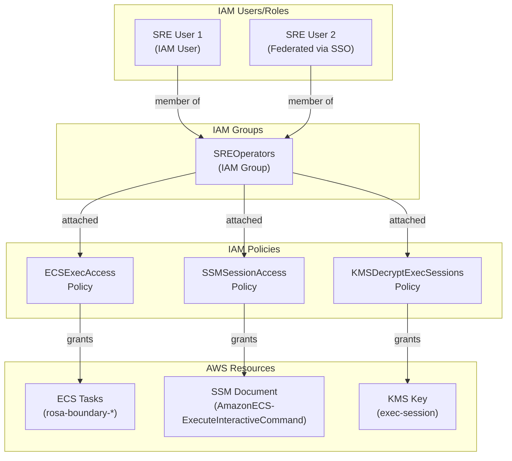

# AWS IAM Policies for Boundary Integration

## Overview

Configure AWS IAM policies to enable users to connect to ECS Fargate containers via Boundary and SSM. This requires permissions for ECS Exec, SSM sessions, and KMS decryption.

## IAM Architecture



## IAM Policy: ECS Exec Access

**Policy Name**: `BoundaryECSExecAccess`

**`iam-policy-ecs-exec.json`:**

```json
{
  "Version": "2012-10-17",
  "Statement": [
    {
      "Sid": "ECSExecCommand",
      "Effect": "Allow",
      "Action": [
        "ecs:ExecuteCommand"
      ],
      "Resource": "arn:aws:ecs:us-east-2:641875867446:task/rosa-boundary-*/*",
      "Condition": {
        "StringEquals": {
          "ecs:cluster": "arn:aws:ecs:us-east-2:641875867446:cluster/rosa-boundary-dev"
        }
      }
    },
    {
      "Sid": "ECSDescribeTasks",
      "Effect": "Allow",
      "Action": [
        "ecs:DescribeTasks",
        "ecs:DescribeTaskDefinition"
      ],
      "Resource": "*"
    },
    {
      "Sid": "ECSListTasks",
      "Effect": "Allow",
      "Action": [
        "ecs:ListTasks"
      ],
      "Resource": "*",
      "Condition": {
        "StringEquals": {
          "ecs:cluster": "arn:aws:ecs:us-east-2:641875867446:cluster/rosa-boundary-dev"
        }
      }
    }
  ]
}
```

## IAM Policy: SSM Session Access

**Policy Name**: `BoundarySSMSessionAccess`

**`iam-policy-ssm-session.json`:**

```json
{
  "Version": "2012-10-17",
  "Statement": [
    {
      "Sid": "StartSSMSession",
      "Effect": "Allow",
      "Action": [
        "ssm:StartSession"
      ],
      "Resource": [
        "arn:aws:ecs:us-east-2:641875867446:task/rosa-boundary-*/*",
        "arn:aws:ssm:us-east-2:641875867446:document/AmazonECS-ExecuteInteractiveCommand"
      ]
    },
    {
      "Sid": "TerminateSSMSession",
      "Effect": "Allow",
      "Action": [
        "ssm:TerminateSession"
      ],
      "Resource": "arn:aws:ssm:us-east-2:641875867446:session/${aws:username}-*",
      "Condition": {
        "StringLike": {
          "ssm:resourceTag/aws:ssmmessages:target-id": "ecs:rosa-boundary-*"
        }
      }
    }
  ]
}
```

## IAM Policy: KMS Decryption

**Policy Name**: `BoundaryKMSDecryptExecSessions`

**`iam-policy-kms-decrypt.json`:**

```json
{
  "Version": "2012-10-17",
  "Statement": [
    {
      "Sid": "DecryptECSExecSessions",
      "Effect": "Allow",
      "Action": [
        "kms:Decrypt",
        "kms:DescribeKey"
      ],
      "Resource": "arn:aws:kms:us-east-2:641875867446:key/*",
      "Condition": {
        "StringEquals": {
          "kms:ViaService": "ssm.us-east-2.amazonaws.com"
        },
        "StringLike": {
          "kms:EncryptionContext:aws:ssm:SessionId": "*"
        }
      }
    },
    {
      "Sid": "GenerateDataKeyForSessions",
      "Effect": "Allow",
      "Action": [
        "kms:GenerateDataKey"
      ],
      "Resource": "arn:aws:kms:us-east-2:641875867446:alias/rosa-boundary-dev-exec-session"
    }
  ]
}
```

## IAM Policy: CloudWatch Logs (Optional)

For viewing session logs:

**Policy Name**: `BoundaryCloudWatchLogsRead`

**`iam-policy-cloudwatch-logs.json`:**

```json
{
  "Version": "2012-10-17",
  "Statement": [
    {
      "Sid": "DescribeLogGroups",
      "Effect": "Allow",
      "Action": [
        "logs:DescribeLogGroups",
        "logs:DescribeLogStreams"
      ],
      "Resource": "arn:aws:logs:us-east-2:641875867446:log-group:/ecs/rosa-boundary-*"
    },
    {
      "Sid": "ReadSessionLogs",
      "Effect": "Allow",
      "Action": [
        "logs:GetLogEvents",
        "logs:FilterLogEvents"
      ],
      "Resource": "arn:aws:logs:us-east-2:641875867446:log-group:/ecs/rosa-boundary-*/ssm-sessions:*"
    }
  ]
}
```

## Creating Policies

```bash
# Set variables
AWS_PROFILE=scuppett-dev
AWS_ACCOUNT=641875867446
AWS_REGION=us-east-2

# Create ECS Exec policy
aws iam create-policy \
  --profile $AWS_PROFILE \
  --policy-name BoundaryECSExecAccess \
  --policy-document file://iam-policy-ecs-exec.json

# Create SSM Session policy
aws iam create-policy \
  --profile $AWS_PROFILE \
  --policy-name BoundarySSMSessionAccess \
  --policy-document file://iam-policy-ssm-session.json

# Create KMS Decrypt policy
aws iam create-policy \
  --profile $AWS_PROFILE \
  --policy-name BoundaryKMSDecryptExecSessions \
  --policy-document file://iam-policy-kms-decrypt.json

# Create CloudWatch Logs policy (optional)
aws iam create-policy \
  --profile $AWS_PROFILE \
  --policy-name BoundaryCloudWatchLogsRead \
  --policy-document file://iam-policy-cloudwatch-logs.json
```

## IAM Group for SRE Users

**Create IAM group and attach policies:**

```bash
# Create group
aws iam create-group \
  --profile $AWS_PROFILE \
  --group-name BoundaryECSAccess

# Attach policies
aws iam attach-group-policy \
  --profile $AWS_PROFILE \
  --group-name BoundaryECSAccess \
  --policy-arn "arn:aws:iam::${AWS_ACCOUNT}:policy/BoundaryECSExecAccess"

aws iam attach-group-policy \
  --profile $AWS_PROFILE \
  --group-name BoundaryECSAccess \
  --policy-arn "arn:aws:iam::${AWS_ACCOUNT}:policy/BoundarySSMSessionAccess"

aws iam attach-group-policy \
  --profile $AWS_PROFILE \
  --group-name BoundaryECSAccess \
  --policy-arn "arn:aws:iam::${AWS_ACCOUNT}:policy/BoundaryKMSDecryptExecSessions"

# Optional: CloudWatch Logs read access
aws iam attach-group-policy \
  --profile $AWS_PROFILE \
  --group-name BoundaryECSAccess \
  --policy-arn "arn:aws:iam::${AWS_ACCOUNT}:policy/BoundaryCloudWatchLogsRead"
```

## Adding Users to Group

### For IAM Users

```bash
aws iam add-user-to-group \
  --profile $AWS_PROFILE \
  --group-name BoundaryECSAccess \
  --user-name jane.doe
```

### For Federated Users (SSO)

If using AWS SSO/Identity Center:

1. Create Permission Set in AWS SSO
2. Attach the four policies to permission set
3. Assign permission set to users/groups

## Terraform Integration

Add to `deploy/regional/iam.tf`:

```hcl
# IAM policies for Boundary users
resource "aws_iam_policy" "boundary_ecs_exec" {
  name        = "BoundaryECSExecAccess"
  description = "Allows Boundary users to execute commands in rosa-boundary ECS tasks"
  policy      = file("${path.module}/policies/iam-policy-ecs-exec.json")
}

resource "aws_iam_policy" "boundary_ssm_session" {
  name        = "BoundarySSMSessionAccess"
  description = "Allows Boundary users to start SSM sessions to ECS tasks"
  policy      = file("${path.module}/policies/iam-policy-ssm-session.json")
}

resource "aws_iam_policy" "boundary_kms_decrypt" {
  name        = "BoundaryKMSDecryptExecSessions"
  description = "Allows decryption of ECS Exec session data"
  policy      = file("${path.module}/policies/iam-policy-kms-decrypt.json")
}

# IAM group for SRE users
resource "aws_iam_group" "boundary_ecs_access" {
  name = "BoundaryECSAccess"
}

resource "aws_iam_group_policy_attachment" "boundary_ecs_exec" {
  group      = aws_iam_group.boundary_ecs_access.name
  policy_arn = aws_iam_policy.boundary_ecs_exec.arn
}

resource "aws_iam_group_policy_attachment" "boundary_ssm_session" {
  group      = aws_iam_group.boundary_ecs_access.name
  policy_arn = aws_iam_policy.boundary_ssm_session.arn
}

resource "aws_iam_group_policy_attachment" "boundary_kms_decrypt" {
  group      = aws_iam_group.boundary_ecs_access.name
  policy_arn = aws_iam_policy.boundary_kms_decrypt.arn
}
```

## Verification

Test IAM permissions:

```bash
# Test ECS Exec permission
aws ecs execute-command \
  --cluster rosa-boundary-dev \
  --task <task-arn> \
  --container rosa-boundary \
  --command "/bin/echo test" \
  --interactive \
  --dry-run

# Test SSM session permission
aws ssm start-session \
  --target ecs:rosa-boundary-dev_<task-id>_rosa-boundary

# Test KMS decrypt (via ECS Exec)
# If ECS Exec works, KMS permissions are valid
```

## Least Privilege Recommendations

### Per-Incident IAM Policies (Advanced)

For stricter isolation, create per-incident IAM policies:

```json
{
  "Sid": "IncidentSpecificAccess",
  "Effect": "Allow",
  "Action": ["ecs:ExecuteCommand"],
  "Resource": "arn:aws:ecs:us-east-2:ACCOUNT:task/rosa-boundary-dev/*",
  "Condition": {
    "StringEquals": {
      "ecs:cluster": "arn:aws:ecs:us-east-2:ACCOUNT:cluster/rosa-boundary-dev",
      "aws:ResourceTag/cluster-id": "rosa-prod-01",
      "aws:ResourceTag/incident-number": "123"
    }
  }
}
```

Attach dynamically during incident creation, detach on closure.

### MFA Requirement

Add MFA condition to sensitive operations:

```json
{
  "Condition": {
    "BoolIfExists": {
      "aws:MultiFactorAuthPresent": "true"
    },
    "NumericLessThan": {
      "aws:MultiFactorAuthAge": "3600"
    }
  }
}
```

## Session Recording Access

ECS Exec sessions are logged to CloudWatch. To view logs:

```bash
# List log streams for a task
aws logs describe-log-streams \
  --log-group-name "/ecs/rosa-boundary-dev/ssm-sessions" \
  --order-by LastEventTime \
  --descending \
  --max-items 10

# View session logs
aws logs get-log-events \
  --log-group-name "/ecs/rosa-boundary-dev/ssm-sessions" \
  --log-stream-name "rosa-boundary/<task-id>/<timestamp>"
```

## Audit Bucket Access

Users should NOT have direct S3 access (write-only for containers):

```json
{
  "Sid": "DenyDirectS3Access",
  "Effect": "Deny",
  "Action": ["s3:*"],
  "Resource": "arn:aws:s3:::*-rosa-boundary-*/*",
  "Condition": {
    "StringNotEquals": {
      "aws:PrincipalArn": [
        "arn:aws:iam::ACCOUNT:role/rosa-boundary-dev-task-role"
      ]
    }
  }
}
```

Audit retrieval should go through separate read-only role (compliance team).

## Terraform Variables

Add to `deploy/regional/variables.tf`:

```hcl
variable "boundary_user_group_name" {
  description = "IAM group name for Boundary ECS access"
  type        = string
  default     = "BoundaryECSAccess"
}

variable "create_boundary_iam_resources" {
  description = "Create IAM policies and group for Boundary integration"
  type        = bool
  default     = false
}
```

## Next Steps

- [User Access Guide](../runbooks/user-access-guide.md) - End-user authentication workflow
- [Keycloak Realm Setup](keycloak-realm-setup.md) - Configure OIDC client
