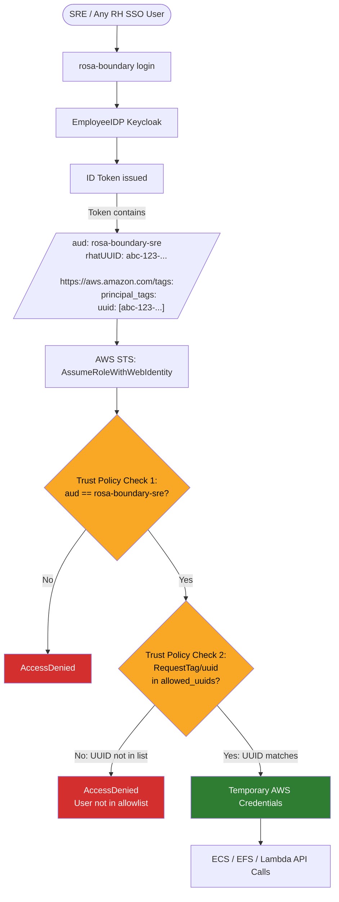

# UUID Allowlist

Interim access control that restricts which users can assume the SRE shared role and Lambda invoker role via `AssumeRoleWithWebIdentity`. When enabled, a user's `rhatUUID` (from the EmployeeIDP JWT `principal_tags.uuid` claim) must appear in a configured allowlist or role assumption is denied server-side by AWS STS.

This is an interim measure. The long-term solution replaces the UUID allowlist with group-derived session tags so that Keycloak group membership controls access automatically.

## How It Works

EmployeeIDP already emits `principal_tags.uuid` in the `https://aws.amazon.com/tags` JWT claim, and `sts:TagSession` is already permitted in the trust policies. Enabling the allowlist adds a `ForAnyValue:StringEquals` condition on `aws:RequestTag/uuid` to all OIDC trust statements on both the SRE shared role (`oidc.tf`) and the Lambda invoker role (`lambda-invoker.tf`).

STS evaluates both conditions during `AssumeRoleWithWebIdentity`:

1. **Audience** must match the OIDC client ID (existing check)
2. **UUID** session tag must be in the allowlist (new check)

If either condition fails, role assumption is denied. If a provider does not emit `principal_tags.uuid` at all, role assumption fails closed.



## Configuration

Two Terraform variables control the feature in `deploy/regional/`:

| Variable | Type | Default | Description |
|----------|------|---------|-------------|
| `enable_uuid_allowlist` | `bool` | `false` | Toggle the UUID condition on all OIDC trust statements |
| `allowed_uuids` | `list(string)` | `[]` | UUIDs permitted to assume the roles. Must contain at least one entry when enabled. Validated as lowercase hex UUIDs with dashes. |

Example `terraform.tfvars`:

```hcl
enable_uuid_allowlist = true
allowed_uuids = [
  "7b5e6e92-0d75-11e7-851d-28d244ea5a6d",
  "a97b94a0-4b53-11ec-abc9-0a58ac14e8ca",
]
```

A lifecycle precondition prevents enabling the allowlist with an empty list.

## Looking Up a User's UUID

The `rhatUUID` is a Red Hat corporate directory attribute exposed by EmployeeIDP. Retrieve it via anonymous LDAP:

```bash
ldapsearch -x -H ldaps://ldap.corp.redhat.com \
  -b "ou=users,dc=redhat,dc=com" "(uid=<kerberos_uid>)" rhatUUID
```

No authentication is required.

## Scope

The condition is applied to **all** OIDC provider trust statements (primary, stage, prod) when enabled. If the primary provider is a self-managed dev Keycloak that does not emit `principal_tags.uuid`, role assumption will fail closed — which is the intended behavior when the allowlist is active.
