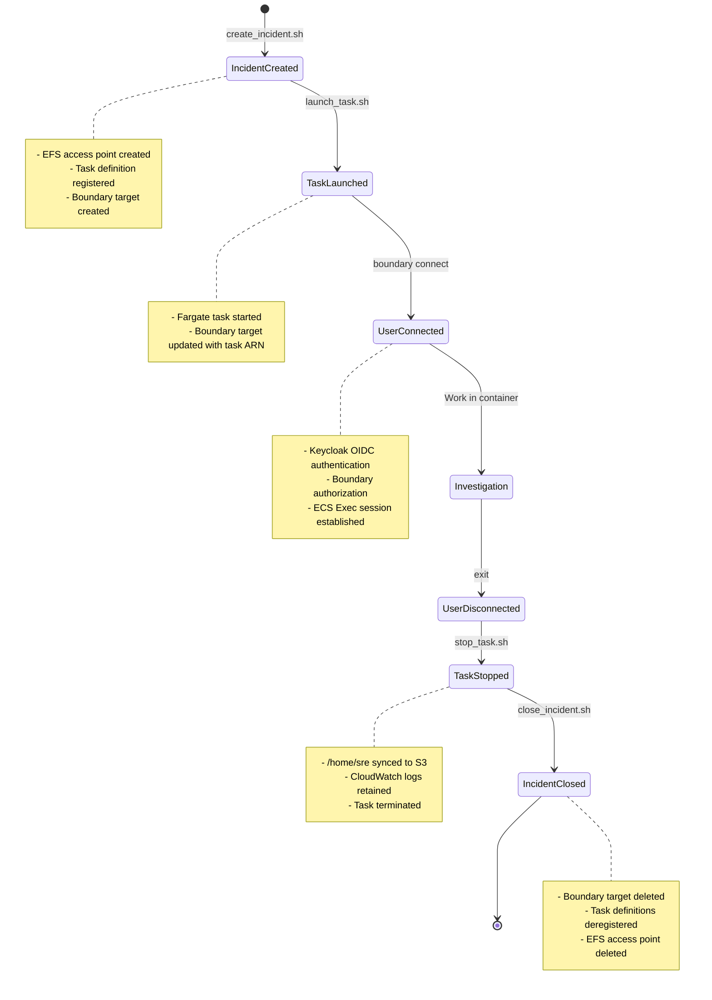
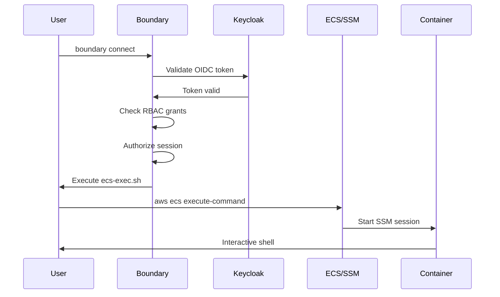

# Incident Workflow with Boundary Integration

## Overview

This runbook describes the complete incident lifecycle with Boundary integration, from creation through access to closure. It extends the existing lifecycle scripts in `deploy/regional/examples/` with Boundary target management.

## Workflow Diagram



## Phase 1: Create Incident

**Script**: `deploy/regional/examples/create_incident.sh`

### Usage

```bash
./create_incident.sh <cluster-id> <incident-number> [oc-version]
```

### Example

```bash
cd deploy/regional/examples
./create_incident.sh rosa-prod-01 456 4.20
```

### What It Does

1. **Creates EFS Access Point**
   ```
   Path: /rosa-prod-01/456/
   POSIX: uid=1000, gid=1000
   Tags:
     - cluster-id: rosa-prod-01
     - incident-number: 456
   ```

2. **Registers Task Definition**
   ```
   Family: rosa-boundary-dev-rosa-prod-01-456-20260103T150000
   Environment Variables:
     - CLUSTER_ID=rosa-prod-01
     - INCIDENT_NUMBER=456
     - OC_VERSION=4.20
     - S3_AUDIT_BUCKET=xxx-rosa-boundary-dev-us-east-2
   ```

3. **Creates Boundary Target**
   ```bash
   boundary targets create tcp \
     -scope-id "$PROJECT_SCOPE_ID" \
     -name "rosa-prod-01-incident-456" \
     -description "Incident 456 for ROSA cluster rosa-prod-01" \
     -default-port 9999 \
     -address localhost \
     -session-max-seconds 28800 \
     -attr "ecs_cluster=rosa-boundary-dev" \
     -attr "cluster_id=rosa-prod-01" \
     -attr "incident_number=456"
   ```

### Output

```
EFS Access Point ID: fsap-0a1b2c3d4e5f
Task Definition Family: rosa-boundary-dev-rosa-prod-01-456-20260103T150000
Boundary Target ID: ttcp_abc123xyz
```

Save these values for later steps.

## Phase 2: Launch Task

**Script**: `deploy/regional/examples/launch_task.sh`

### Usage

```bash
./launch_task.sh <task-family>
```

### Example

```bash
./launch_task.sh rosa-boundary-dev-rosa-prod-01-456-20260103T150000
```

### What It Does

1. **Launches Fargate Task**
   ```bash
   aws ecs run-task \
     --cluster rosa-boundary-dev \
     --launch-type FARGATE \
     --task-definition <family>:latest \
     --enable-execute-command \
     --network-configuration {...} \
     --platform-version 1.4.0
   ```

2. **Waits for RUNNING State**
   - Polls task status every 5 seconds
   - Timeout after 5 minutes
   - Returns task ARN when RUNNING

3. **Updates Boundary Target**
   ```bash
   boundary targets update \
     -id ttcp_abc123xyz \
     -attr "ecs_task_arn=arn:aws:ecs:us-east-2:xxx:task/rosa-boundary-dev/task123"
   ```

### Output

```
Task ARN: arn:aws:ecs:us-east-2:641875867446:task/rosa-boundary-dev/a1b2c3d4e5f6
Task Status: RUNNING
Boundary Target Updated: ttcp_abc123xyz
```

## Phase 3: Connect to Container (User)

**User Action**: SRE connects via Boundary

### Usage

```bash
# Method 1: Using wrapper script
~/.boundary/boundary-ecs-connect.sh ttcp_abc123xyz

# Method 2: Manual with target ID
boundary connect \
  -target-id ttcp_abc123xyz \
  -exec ~/.boundary/ecs-exec.sh
```

### What Happens



### Session Output

```
[2026-01-03T15:30:00Z] Connecting to ECS task...
  Cluster: rosa-boundary-dev
  Task: a1b2c3d4e5f6
  Container: rosa-boundary
  User: sre

The Session Manager plugin was installed successfully. Use the AWS CLI to start a session.


Starting session with SessionId: user-abc123...
[sre@container ~]$
```

## Phase 4: Investigation Work

User performs incident investigation in the container:

```bash
# Set up OpenShift context
oc login --token=<token> --server=https://api.rosa-prod-01.example.com:6443

# Gather diagnostics
oc get nodes
oc get pods --all-namespaces | grep -i error
oc logs -n problematic-namespace pod-name

# Save findings
cat > ~/incident-456-findings.md << 'EOF'
# Incident 456 Investigation

## Problem
High CPU on worker nodes...

## Root Cause
...

## Resolution
...
EOF

# Download configs for analysis
oc get deployment problematic-app -n app-namespace -o yaml > ~/app-deployment.yaml
```

All files in `/home/sre` are persisted to EFS and synced to S3 on exit.

## Phase 5: Disconnect

User exits the shell:

```bash
[sre@container ~]$ exit
logout

[2026-01-03T17:45:00Z] Session ended normally
Connection to boundary closed.
```

### What Happens on Exit

1. **Container entrypoint cleanup**:
   ```bash
   # entrypoint.sh cleanup() function
   aws s3 sync /home/sre/ \
     s3://bucket/rosa-prod-01/456/20260103/task123/
   ```

2. **S3 audit sync**:
   ```
   s3://bucket/rosa-prod-01/456/20260103/task123/
   ├── .bash_history
   ├── incident-456-findings.md
   ├── app-deployment.yaml
   └── .claude/...
   ```

3. **Boundary session record**:
   - `end_time` updated
   - `status` set to `terminated`
   - Duration calculated

## Phase 6: Stop Task

**Script**: `deploy/regional/examples/stop_task.sh`

### Usage

```bash
./stop_task.sh <task-arn> [reason]
```

### Example

```bash
./stop_task.sh arn:aws:ecs:us-east-2:xxx:task/rosa-boundary-dev/a1b2c3d4 "Investigation complete"
```

### What It Does

1. Sends SIGTERM to task
2. Entrypoint cleanup runs (S3 sync)
3. Task transitions to STOPPED
4. Displays expected S3 audit location

## Phase 7: Close Incident

**Script**: `deploy/regional/examples/close_incident.sh`

### Usage

```bash
./close_incident.sh <task-family> <access-point-id> <boundary-target-id>
```

### Example

```bash
./close_incident.sh \
  rosa-boundary-dev-rosa-prod-01-456-20260103T150000 \
  fsap-0a1b2c3d4e5f \
  ttcp_abc123xyz
```

### What It Does

1. **Checks for running tasks**
   - Prevents deletion if tasks still active
   - Lists running tasks for the family

2. **Deletes Boundary target**
   ```bash
   boundary targets delete -id ttcp_abc123xyz
   ```

3. **Deregisters task definitions**
   - All revisions for the family
   - Prevents future launches

4. **Deletes EFS access point** (with confirmation)
   - Prompts: "Delete access point? This does NOT delete data. (yes/no)"
   - EFS data remains in filesystem at `/rosa-prod-01/456/`

### Output

```
Checking for running tasks in family rosa-boundary-dev-rosa-prod-01-456-20260103T150000...
No running tasks found.

Deleting Boundary target ttcp_abc123xyz...
Target deleted successfully.

Deregistering task definition family rosa-boundary-dev-rosa-prod-01-456-20260103T150000...
Deregistered 1 revision(s).

Delete access point fsap-0a1b2c3d4e5f? This does NOT delete data. (yes/no): yes
Access point deleted successfully.

Incident 456 closed. Audit data:
  S3: s3://bucket/rosa-prod-01/456/20260103/task123/
  EFS: /rosa-prod-01/456/ (filesystem retained)
```

## Complete Example

End-to-end incident workflow:

```bash
# === Administrator: Create incident ===
cd deploy/regional/examples

# Create infrastructure
OUTPUT=$(./create_incident.sh rosa-prod-01 789 4.20)
ACCESS_POINT_ID=$(echo "$OUTPUT" | grep "Access Point" | awk '{print $NF}')
TASK_FAMILY=$(echo "$OUTPUT" | grep "Task Definition" | awk '{print $NF}')
TARGET_ID=$(echo "$OUTPUT" | grep "Boundary Target" | awk '{print $NF}')

# Launch task
TASK_ARN=$(./launch_task.sh "$TASK_FAMILY" | grep "Task ARN" | awk '{print $NF}')

echo "Incident 789 ready. Target ID: $TARGET_ID"

# === User: Connect and investigate ===
boundary authenticate oidc
~/.boundary/boundary-ecs-connect.sh "$TARGET_ID"

# ... investigation work ...

exit

# === Administrator: Close incident ===
./stop_task.sh "$TASK_ARN" "Investigation complete"
./close_incident.sh "$TASK_FAMILY" "$ACCESS_POINT_ID" "$TARGET_ID"
```

## Parallel Incidents

Multiple incidents can run simultaneously:

```bash
# Create 3 incidents for the same cluster
./create_incident.sh rosa-prod-01 801 4.18
./create_incident.sh rosa-prod-01 802 4.19
./create_incident.sh rosa-prod-01 803 4.20

# Each gets:
# - Separate EFS path: /rosa-prod-01/801/, /rosa-prod-01/802/, /rosa-prod-01/803/
# - Separate task definition family
# - Separate Boundary target

# Users can connect to any they have access to
```

## Automation Opportunities

### CI/CD Integration

```yaml
# GitHub Actions example
name: Create Incident

on:
  issues:
    types: [labeled]

jobs:
  create:
    if: github.event.label.name == 'needs-incident'
    runs-on: ubuntu-latest
    steps:
      - uses: actions/checkout@v3
      - name: Create incident
        run: |
          INCIDENT_NUM="${{ github.event.issue.number }}"
          CLUSTER_ID="rosa-prod-01"
          ./deploy/regional/examples/create_incident.sh "$CLUSTER_ID" "$INCIDENT_NUM"
      - name: Comment on issue
        uses: actions/github-script@v6
        with:
          script: |
            github.rest.issues.createComment({
              issue_number: context.issue.number,
              owner: context.repo.owner,
              repo: context.repo.repo,
              body: 'Incident container created. Target ID: ...'
            })
```

### Scheduled Cleanup

```bash
# Cron job to clean up old stopped tasks
0 2 * * * /path/to/cleanup-old-incidents.sh 7  # 7 days
```

## Next Steps

- [User Access Guide](user-access-guide.md) - Instructions for SRE users
- [Troubleshooting](troubleshooting.md) - Common issues and solutions
