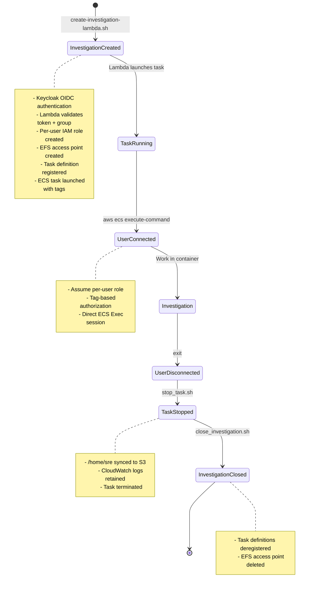
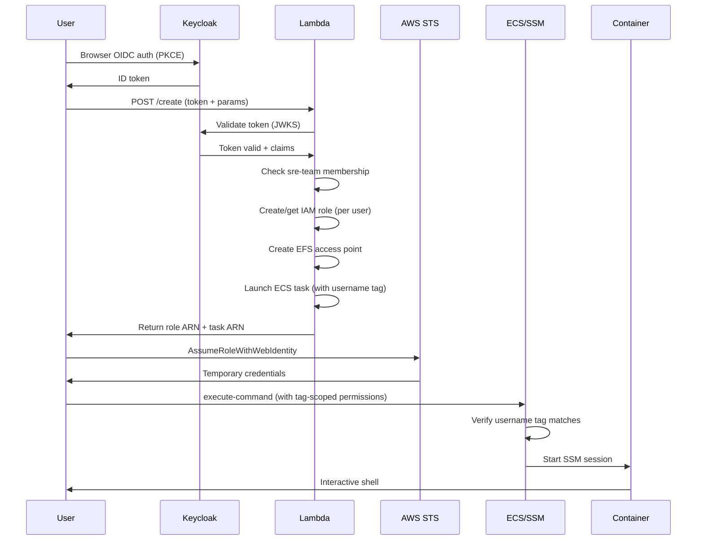

# Investigation Workflow

## Overview

This runbook describes the complete investigation lifecycle using Lambda-based OIDC authentication, from creation through access to closure. It extends the existing lifecycle scripts in `deploy/regional/examples/` with automated IAM role management and tag-based isolation.

## Workflow Diagram



## Phase 1: Create Investigation

**Script**: `tools/create-investigation-lambda.sh`

### Usage

```bash
./create-investigation-lambda.sh <cluster-id> <investigation-id> [oc-version]
```

### Example

```bash
cd tools/
./create-investigation-lambda.sh rosa-prod-01 456 4.20
```

### What It Does

1. **Authenticates with Keycloak**
   - Browser popup for OIDC authentication (PKCE flow)
   - Token cached for 4 minutes to reduce popup fatigue
   - Token sent to Lambda in Authorization header

2. **Lambda Validates Request**
   - Verifies OIDC token signature against Keycloak JWKS
   - Checks `sre-team` group membership
   - Extracts user's OIDC `sub` claim

3. **Lambda Creates IAM Role** (if not exists)
   ```
   Role Name: rosa-boundary-user-{hash-of-sub}
   Policies:
     - ExecuteCommandOnCluster (ecs:ExecuteCommand on cluster)
     - ExecuteCommandOnOwnedTasks (ecs:ExecuteCommand on tasks with matching username tag)
     - DescribeAndListECS (ecs:DescribeTasks, ecs:ListTasks)
     - SSMSessionForECSExec (ssm:StartSession with tag condition)
     - KMSForECSExec (kms:Decrypt for encrypted sessions)
   ```

4. **Lambda Creates EFS Access Point**
   ```
   Path: /rosa-prod-01/456/
   POSIX: uid=1000, gid=1000
   Tags:
     - ClusterID: rosa-prod-01
     - InvestigationId: 456
   ```

5. **Lambda Registers Task Definition**
   ```
   Family: rosa-boundary-dev-rosa-prod-01-456-20260103T150000
   Environment Variables:
     - CLUSTER_ID=rosa-prod-01
     - INVESTIGATION_ID=456
     - OC_VERSION=4.20
     - S3_AUDIT_BUCKET=xxx-rosa-boundary-dev-us-east-2
   ```

6. **Lambda Launches ECS Task**
   ```
   Tags:
     - oidc_sub: {oidc-sub-claim}
     - username: {preferred-username}
     - cluster_id: rosa-prod-01
     - investigation_id: 456
   ```

7. **Script Assumes IAM Role**
   - Calls `assume-role.sh` with returned role ARN
   - Exports AWS credentials to environment
   - Role permissions scoped to tasks with matching `username` tag

### Output

```
========================================
Investigation Created Successfully! 🎉
========================================

Investigation Details:
  Cluster:        rosa-prod-01
  Investigation:  456
  Task:           a1b2c3d4e5f6
  OC Version:     4.20
  EFS Access Pt:  fsap-0a1b2c3d4e5f
  Your Role:      arn:aws:iam::123456789012:role/rosa-boundary-user-abc123

Connect to task:
  aws ecs execute-command \
    --cluster rosa-prod-01 \
    --task a1b2c3d4e5f6 \
    --container rosa-boundary \
    --interactive \
    --command /bin/bash \
    --region us-east-2

Or use the join helper:
  ./join-investigation.sh a1b2c3d4e5f6
```

Save the task ID for connection and cleanup.

## Phase 2: Connect to Container

**User Action**: SRE connects via ECS Exec

### Usage

```bash
# Method 1: Using helper script
./tools/join-investigation.sh <task-id>

# Method 2: Direct ECS Exec command
aws ecs execute-command \
  --cluster rosa-prod-01 \
  --task a1b2c3d4e5f6 \
  --container rosa-boundary \
  --interactive \
  --command /bin/bash \
  --region us-east-2
```

### What Happens



### Session Output

```
The Session Manager plugin was installed successfully. Use the AWS CLI to start a session.


Starting session with SessionId: user-abc123...
[sre@container ~]$
```

## Phase 3: Investigation Work

User performs investigation work in the container:

```bash
# Set up OpenShift context
oc login --token=<token> --server=https://api.rosa-prod-01.example.com:6443

# Gather diagnostics
oc get nodes
oc get pods --all-namespaces | grep -i error
oc logs -n problematic-namespace pod-name

# Save findings
cat > ~/investigation-456-findings.md << 'EOF'
# Investigation 456 Findings

## Problem
High CPU on worker nodes...

## Root Cause
...

## Resolution
...
EOF

# Download configs for analysis
oc get deployment problematic-app -n app-namespace -o yaml > ~/app-deployment.yaml
```

All files in `/home/sre` are persisted to EFS and synced to S3 on exit.

## Phase 4: Disconnect

User exits the shell:

```bash
[sre@container ~]$ exit
logout


Exiting session with sessionId: user-abc123.
```

### What Happens on Exit

1. **Container entrypoint cleanup**:
   ```bash
   # entrypoint.sh cleanup() function
   # Auto-generates S3 path from task metadata
   aws s3 sync /home/sre/ \
     s3://bucket/rosa-prod-01/456/20260103/task123/
   ```

2. **S3 audit sync**:
   ```
   s3://bucket/rosa-prod-01/456/20260103/task123/
   ├── .bash_history
   ├── investigation-456-findings.md
   ├── app-deployment.yaml
   └── .claude/...
   ```

## Phase 5: Stop Task

**Script**: `deploy/regional/examples/stop_task.sh`

### Usage

```bash
./stop_task.sh <task-id> [reason]
```

### Example

```bash
cd deploy/regional/examples
./stop_task.sh a1b2c3d4 "Investigation complete"
```

### What It Does

1. Sends SIGTERM to task
2. Entrypoint cleanup runs (S3 sync)
3. Task transitions to STOPPED
4. Displays expected S3 audit location

## Phase 6: Close Investigation

**Script**: `deploy/regional/examples/close_investigation.sh`

### Usage

```bash
./close_investigation.sh <task-family> <access-point-id>
```

### Example

```bash
./close_investigation.sh \
  rosa-boundary-dev-rosa-prod-01-456-20260103T150000 \
  fsap-0a1b2c3d4e5f
```

### What It Does

1. **Checks for running tasks**
   - Prevents deletion if tasks still active
   - Lists running tasks for the family

2. **Deregisters task definitions**
   - All revisions for the family
   - Prevents future launches

3. **Deletes EFS access point** (with confirmation)
   - Prompts: "Delete access point? This does NOT delete data. (yes/no)"
   - EFS data remains in filesystem at `/rosa-prod-01/456/`

### Output

```
Checking for running tasks in family rosa-boundary-dev-rosa-prod-01-456-20260103T150000...
No running tasks found.

Deregistering task definition family rosa-boundary-dev-rosa-prod-01-456-20260103T150000...
Deregistered 1 revision(s).

Delete access point fsap-0a1b2c3d4e5f? This does NOT delete data. (yes/no): yes
Access point deleted successfully.

==========================================
✓ Investigation closed successfully!
==========================================

Cleaned up:
  ✓ Task definition family: rosa-boundary-dev-rosa-prod-01-456-20260103T150000 (all revisions)
  ✓ EFS access point: fsap-0a1b2c3d4e5f

Note: EFS data at /rosa-prod-01/456 is preserved on the filesystem.
The directory will remain but is no longer accessible via this access point.
```

## Complete Example

End-to-end investigation workflow:

```bash
# === User: Create investigation ===
cd tools/

# Create infrastructure and launch task (all-in-one)
./create-investigation-lambda.sh rosa-prod-01 789 4.20

# Output includes task ID and connection command
# Save TASK_ID from output (e.g., a1b2c3d4e5f6)

# === User: Connect and investigate ===
./join-investigation.sh a1b2c3d4e5f6

# ... investigation work ...

exit

# === User: Close investigation ===
cd ../deploy/regional/examples

# Stop the task (triggers S3 sync)
./stop_task.sh a1b2c3d4e5f6 "Investigation complete"

# Close investigation (from create-investigation-lambda.sh output)
./close_investigation.sh \
  rosa-boundary-dev-rosa-prod-01-789-20260103T150000 \
  fsap-0a1b2c3d4e5f
```

## Parallel Investigations

Multiple investigations can run simultaneously:

```bash
# Create 3 investigations for the same cluster
./create-investigation-lambda.sh rosa-prod-01 801 4.18
./create-investigation-lambda.sh rosa-prod-01 802 4.19
./create-investigation-lambda.sh rosa-prod-01 803 4.20

# Each gets:
# - Separate EFS path: /rosa-prod-01/801/, /rosa-prod-01/802/, /rosa-prod-01/803/
# - Separate task definition family
# - Tag-based isolation (users can only access own tasks)

# Users can only connect to tasks they created (username tag enforcement)
```

## Tag-Based Authorization Model

**How it works**:

1. **Per-User IAM Roles**: Each user gets a unique role based on their OIDC `sub` claim
2. **Task Tagging**: Tasks are tagged with `username` at launch
3. **Policy Enforcement**: IAM policies restrict `ecs:ExecuteCommand` to tasks with matching tag

**Example IAM Policy** (in user's role):
```json
{
  "Effect": "Allow",
  "Action": "ecs:ExecuteCommand",
  "Resource": "arn:aws:ecs:*:*:task/*",
  "Condition": {
    "StringEquals": {
      "ecs:ResourceTag/username": "${aws:userid}"
    }
  }
}
```

**Benefits**:
- Cross-user task access prevented at IAM policy level
- No manual permission management
- Scales to unlimited users
- Audit trail via CloudTrail (who accessed what)

## Automation Opportunities

### CI/CD Integration

```yaml
# GitHub Actions example
name: Create Investigation

on:
  issues:
    types: [labeled]

jobs:
  create:
    if: github.event.label.name == 'needs-investigation'
    runs-on: ubuntu-latest
    steps:
      - uses: actions/checkout@v3
      - name: Create investigation
        run: |
          INVESTIGATION_NUM="${{ github.event.issue.number }}"
          CLUSTER_ID="rosa-prod-01"

          # Note: Requires GitHub Actions OIDC integration
          ./tools/create-investigation-lambda.sh "$CLUSTER_ID" "$INVESTIGATION_NUM"
      - name: Comment on issue
        uses: actions/github-script@v6
        with:
          script: |
            github.rest.issues.createComment({
              issue_number: context.issue.number,
              owner: context.repo.owner,
              repo: context.repo.repo,
              body: 'Investigation container created. See Actions output for connection details.'
            })
```

### Scheduled Cleanup

```bash
# Cron job to clean up old stopped tasks
0 2 * * * /path/to/cleanup-old-investigations.sh 7  # 7 days
```

## Troubleshooting

### Token Cache Issues

```bash
# Force fresh OIDC authentication
tools/sre-auth/get-oidc-token.sh --force
```

### Permission Denied on ECS Exec

**Symptom**: `AccessDeniedException` when running `aws ecs execute-command`

**Cause**: IAM role doesn't have permission (likely `username` tag mismatch)

**Solution**:
1. Verify you're using credentials from the investigation creation
2. Check task tags match your OIDC `sub` claim
3. Verify role was created correctly by Lambda

### Lambda Authorization Failed

**Symptom**: `{"error": "Forbidden: User not in sre-team group"}`

**Cause**: User not member of `sre-team` group in Keycloak

**Solution**: Contact Keycloak admin to add user to group

## Next Steps

- [User Access Guide](user-access-guide.md) - Instructions for SRE users
- [Troubleshooting](troubleshooting.md) - Common issues and solutions
- [Tag-Based Isolation](../TAG_BASED_ISOLATION.md) - Deep dive on authorization model
