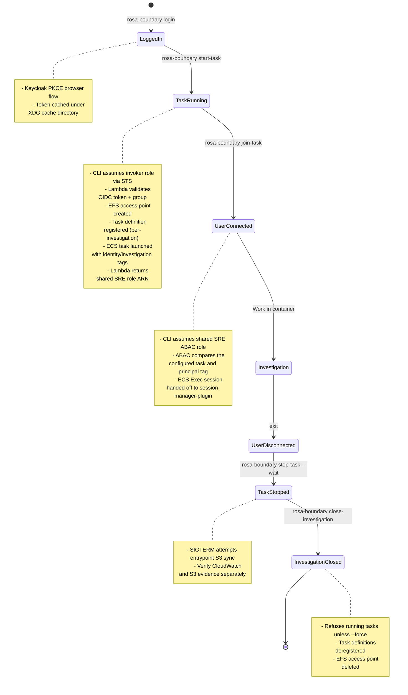

# Investigation Workflow

## Overview

This runbook describes the complete investigation lifecycle using the `rosa-boundary` CLI with
Lambda-based OIDC authentication, from creation through access to closure. The CLI handles
OIDC authentication, role assumption, and ECS Exec session hand-off; audit retrieval is a
separate operator/audit-reader workflow. Use an approved target and confirm the intended
account and region before creating a task.
Replace all `<...>` placeholders with approved values before running commands;
angle brackets in a shell command are redirection operators, not literal syntax.

## Workflow Diagram


```mermaid
stateDiagram-v2
    [*] --> LoggedIn: rosa-boundary login
    LoggedIn --> TaskRunning: rosa-boundary start-task
    TaskRunning --> UserConnected: rosa-boundary join-task
    UserConnected --> Investigation: Work in container
    Investigation --> UserDisconnected: exit
    UserDisconnected --> TaskStopped: rosa-boundary stop-task --wait
    TaskStopped --> InvestigationClosed: rosa-boundary close-investigation
    InvestigationClosed --> [*]

    note right of LoggedIn
        - Keycloak PKCE browser flow
        - Token cached under XDG cache directory
    end note

    note right of TaskRunning
        - CLI assumes invoker role via STS
        - Lambda validates OIDC token + group
        - EFS access point created
        - Task definition registered (per-investigation)
        - ECS task launched with identity/investigation tags
        - Lambda returns shared SRE role ARN
    end note

    note right of UserConnected
        - CLI assumes shared SRE ABAC role
        - ABAC compares the configured task and principal tag
        - ECS Exec session handed off to session-manager-plugin
    end note

    note right of TaskStopped
        - SIGTERM attempts entrypoint S3 sync
        - Verify CloudWatch and S3 evidence separately
    end note

    note right of InvestigationClosed
        - Refuses running tasks unless --force
        - Task definitions deregistered
        - EFS access point deleted
    end note
```

## Prerequisites

```bash
# Build the CLI
make build-cli

# Verify session-manager-plugin is installed (required for join-task)
session-manager-plugin --version
```

No existing AWS credentials or AWS CLI are required for normal Boundary CLI use.
An AWS CLI with separate CloudWatch Logs and S3 read permissions is needed for
the audit verification examples below.

## Configure for the intended deployment

Follow the [user access guide](user-access-guide.md#3-configure-cli) to discover
configuration using the operator-supplied account, region, project, and
environment. Check the discovered Lambda, role ARNs, cluster, and EFS filesystem
before proceeding. For a non-default identity provider supply its OIDC settings;
`login` alone does not configure the roles needed by the other commands.

## Phase 1: Authenticate

```bash
./bin/rosa-boundary login
```

What it does:
- Opens a browser for Keycloak PKCE authentication when a fresh token is needed
- Caches the OIDC token under `${XDG_CACHE_HOME:-$HOME/.cache}/rosa-boundary/token-cache`
- Reuses a valid token until shortly before its expiry

## Phase 2: Start Investigation

```bash
./bin/rosa-boundary start-task \
  --cluster-id <cluster-id> \
  --investigation-id <investigation-id>
```

Optional flags:
```
  --task-timeout 3600     # seconds; must meet the deployment's minimum
  --oc-version 4.20       # OpenShift CLI version to lock; check CLI help for default
  --with-credentials ocm  # configure a fresh OCM token before returning
  --ocm-url production    # production, staging, integration, or canonical URL
  --ocm-auth-flow device  # headless fallback; auth-code is the default
```

`--with-credentials` cannot be combined with `--no-wait`. If configuration
fails after task creation, the CLI reports the still-running task ID and the
exact `stop-task` cleanup command.

What it does:
1. **CLI assumes the invoker role** via STS using the OIDC ID token (no existing AWS credentials)
2. **Invokes the create-investigation Lambda** with the cached OIDC token
3. **Lambda validates** the token against Keycloak JWKS and checks the deployment's required group and ABAC claim
4. **Lambda creates an EFS access point**: `/<cluster-id>/<investigation-id>/`
5. **Lambda registers a per-investigation task definition** with locked OC version and pre-set env vars
6. **Lambda launches the ECS task** with the deployment's ABAC tag and investigation/deadline tags
7. **Lambda returns the shared SRE role ARN** and task ARN
8. CLI prints connection command

Output includes the task ID — save it for join/stop/close steps.

## Phase 3: List Tasks

```bash
./bin/rosa-boundary list-tasks \
  --status RUNNING
```

Shows: task ID, status, cluster, investigation ID, username, start time.

## Phase 4: Connect to Container

```bash
./bin/rosa-boundary join-task <task-id>
```

What it does:
1. Assumes the shared SRE ABAC role (using the deployment's configured tag key)
2. Calls `ecs:ExecuteCommand` — IAM compares the task's ABAC tag with the caller's OIDC-derived session tag
3. Waits for the container exec agent to open its data channel
4. Replaces the current process with `session-manager-plugin` for a seamless terminal

Inside the container (as `sre` user):
```bash
whoami              # sre
echo $CLUSTER_ID    # <cluster-id>
echo $INVESTIGATION_ID  # <investigation-id>
claude --version    # Confirms installation, not Bedrock access
oc version --client # OpenShift CLI (locked to investigation version)
```

### Verify Bedrock access from a fresh task

After a regional Terraform change to the base ECS task definition, create a
**new** investigation task: Lambda copies the base container environment into
each per-investigation task definition, so a running task or an older
per-investigation definition does not acquire new defaults. In the new task,
use only a benign test prompt (Bedrock invocation logs can include the full
prompt and response):

```bash
printf 'Region: %s\nModel: %s\n' "$AWS_REGION" "$ANTHROPIC_MODEL"
claude "Reply with the word ready."
```

For the current staging configuration, the model should be
`us.anthropic.claude-sonnet-5` without manually setting `ANTHROPIC_MODEL`.
`claude --version` alone does not exercise inference. If invocation fails,
compare the profile with `claude_default_model` and the explicit profile-to-
foundation-model mapping in `deploy/regional/main.tf`. From **outside the
task**, using an operator identity with Bedrock control-plane permissions,
check the *foundation* model ID in the same account and Region:

```bash
aws bedrock get-foundation-model-availability \
  --region us-east-1 --model-id anthropic.claude-sonnet-5 \
  --query '{agreement:agreementAvailability.status,authorization:authorizationStatus,entitlement:entitlementAvailability,region:regionAvailability}'
```

The task role is not granted this availability-check API or AWS Marketplace
subscription permissions. For Anthropic models, first-time-use setup must
also be complete. An unlisted model may fail because it is not enabled, but
the agreement manifest is **not** an IAM allowlist: a model enabled elsewhere
in the account may work, and AWS documents that a first invocation can
temporarily succeed while subscription is attempted. Record the actual
availability and invocation results rather than treating a single 403 or
successful call as proof of model-allowlist enforcement. See the
[model-agreement guide](../configuration/bedrock-model-agreements.md) and
the [regional troubleshooting notes](../../deploy/regional/README.md#bedrock-access-denied).

Ordinary files in `/home/sre` persist to EFS across task restarts for the same
investigation. OCM state under `.config/ocm` and kubeconfig state under `.kube`
are task-scoped, excluded from S3 sync, and destroyed when the task stops.

### Configure or clear OCM on an existing task

```bash
# Uses a fresh authorization-code-with-PKCE token
./bin/rosa-boundary credentials configure ocm <task-id> --ocm-url production

# Headless/device fallback
./bin/rosa-boundary credentials configure ocm <task-id> \
  --ocm-url staging \
  --auth-flow device

# Immediate removal; also removes credential-derived ~/.kube/config
./bin/rosa-boundary credentials clear ocm <task-id>
```

If `--ocm-url` is omitted, only the non-secret `url` field is read from the
workstation's `${XDG_CONFIG_HOME:-$HOME/.config}/ocm/ocm.json`. No local token
is reused or copied. Re-running configure atomically replaces an expired token.
Stopping the task remains authoritative cleanup even if clear is not run.

To exercise workspace persistence and audit without customer data, create a
harmless file such as `printf 'boundary smoke test\n' > ~/boundary-smoke-test.txt`
inside the task. Then `exit` the interactive shell. This **disconnects ECS Exec**;
the task stays running until stopped or reaped and no S3 sync is implied.

## Phase 5: Stop Task (Triggers S3 Sync)

```bash
./bin/rosa-boundary stop-task <task-id> --wait
```

What it does:
1. Sends SIGTERM to the ECS task
2. Container entrypoint attempts to sync non-credential `/home/sre/` content to S3
3. S3 path is auto-generated: `s3://<bucket>/<cluster-id>/<investigation-id>/<YYYYMMDD>/<task-id>/`

`--wait` confirms the task reached STOPPED, **not** that S3 sync succeeded.
The entrypoint warns and continues on sync failure or timeout. Check the container
log for warnings and verify the object in S3 before treating audit escrow as complete.

## Verify Audit Evidence

Use an **operator/audit-reader AWS identity** with CloudWatch Logs and S3 read
permissions in the correct account and region. The Boundary SRE role and the task
role do not provide general audit-read access. Obtain the deployed log group
names and audit bucket from the operator (or regional Terraform outputs); do not
guess them from a CLI task ID. In the following examples, supply the actual values:

```bash
aws logs describe-log-streams \
  --log-group-name '<ssm-session-log-group>' \
  --order-by LastEventTime --descending --region '<region>'
aws logs get-log-events \
  --log-group-name '<ssm-session-log-group>' \
  --log-stream-name '<stream-name-from-describe-log-streams>' --region '<region>'

# Inspect container output for audit-sync warnings (select its actual stream first).
aws logs describe-log-streams \
  --log-group-name '<container-log-group>' \
  --order-by LastEventTime --descending --region '<region>'

aws s3 ls 's3://<audit-bucket>/<cluster-id>/<investigation-id>/<YYYYMMDD>/<task-id>/' \
  --recursive --region '<region>'
```

Confirm that the harmless test file is present in S3 and that the session log
has the expected activity. Empty or missing evidence must be investigated;
STOPPED is insufficient. Credential mounts (`.config/ocm` and `.kube`) are excluded
from the sync and should not appear in audit escrow. Protect downloaded audit
artifacts under the deployment's retention and access policies.

## Phase 6: Close Investigation

```bash
./bin/rosa-boundary close-investigation \
  --cluster-id <cluster-id> \
  --investigation-id <investigation-id>
```

What it does:
1. Finds the EFS access point (using its configured filesystem ID)
2. Refuses to close while a task is running unless `--force` is supplied; stop and verify audit evidence first
3. Attempts to deregister associated task definition revisions; inspect any warnings
4. Prompts for confirmation before deleting the EFS access point (unless `--yes`); EFS data remains on the filesystem

`--cluster-id` is optional if the investigation ID is unique; specify it to disambiguate. Ensure `efs_filesystem_id` was discovered or configured before closing.

## Complete Example

```bash
# After configuring the intended deployment, choose an approved target.
CLUSTER_ID="<approved-cluster-id>"
INV_ID="<unique-investigation-id>"

# 1. Authenticate
./bin/rosa-boundary login

# 2. Start investigation (save TASK_ID from output)
./bin/rosa-boundary start-task \
  --cluster-id "$CLUSTER_ID" \
  --investigation-id "$INV_ID"

TASK_ID="<from output>"

# 3. Connect
./bin/rosa-boundary join-task "$TASK_ID"

# Inside the task: printf 'boundary smoke test\n' > ~/boundary-smoke-test.txt
# Then exit the interactive shell (task remains running).

# 4. Stop task
./bin/rosa-boundary stop-task "$TASK_ID" --wait

# 5. Verify CloudWatch and S3 audit evidence using an audit-reader identity
# (see "Verify Audit Evidence" above).

# 6. Close investigation; confirm deletion at the prompt
./bin/rosa-boundary close-investigation \
  --cluster-id "$CLUSTER_ID" \
  --investigation-id "$INV_ID"
```

## Authorization Model

The deployment's shared SRE role is scoped at runtime by ABAC:

- Lambda tags tasks with the configured ABAC tag key and identity value
- STS derives principal session tags from the OIDC token's `https://aws.amazon.com/tags` claim; the IAM role trust permits `sts:TagSession`
- The role policy compares `ecs:ResourceTag/<configured-key>` with `aws:PrincipalTag/<configured-key>` for ECS Exec
- Cross-user task access is prevented at IAM policy level without per-user roles

For log retrieval use [Verify Audit Evidence](#verify-audit-evidence), not the task's AWS identity.

## Troubleshooting

### Token cache stale
```bash
./bin/rosa-boundary login --force
```

### AccessDeniedException on join-task
- Possible cause: task and OIDC-derived principal tags do not match for the deployment's ABAC key. Ask an operator with ECS read access to inspect the task tags and check the identity provider mapping and IAM policy.

### Lambda returns 403 Forbidden
- Possible cause: missing configured group or ABAC claim. An STS role-trust denial occurs *before* Lambda and needs different troubleshooting. Confirm the failing stage and ask the operator about the deployment's trust and group settings.

### session-manager-plugin: connection drops immediately
- Cause: Container exec agent hasn't opened its WebSocket yet
- The CLI waits for the agent; if it still fails, check whether ECS Exec is enabled on the task

## Related

- [Troubleshooting](troubleshooting.md)
- [User Access Guide](user-access-guide.md)
- [AWS IAM Policies](../configuration/aws-iam-policies.md)
