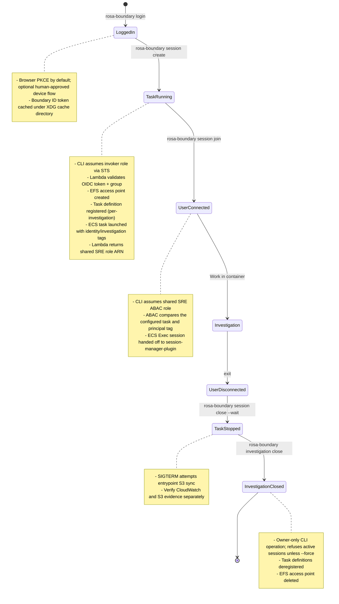

# Investigation Workflow

## Overview

This runbook describes the complete investigation lifecycle using the `rosa-boundary` CLI with
Lambda-based OIDC authentication, from creation through access to closure. The CLI handles
OIDC authentication, role assumption, and ECS Exec session hand-off; audit retrieval is a
separate operator/audit-reader workflow. Use an approved target and confirm the intended
account and region before creating a task.
Replace all `<...>` placeholders with approved values before running commands;
angle brackets in a shell command are redirection operators, not literal syntax.

## Workflow Diagram


```mermaid
stateDiagram-v2
    [*] --> LoggedIn: rosa-boundary login
    LoggedIn --> TaskRunning: rosa-boundary session create
    TaskRunning --> UserConnected: rosa-boundary session join
    UserConnected --> Investigation: Work in container
    Investigation --> UserDisconnected: exit
    UserDisconnected --> TaskStopped: rosa-boundary session close --wait
    TaskStopped --> InvestigationClosed: rosa-boundary investigation close
    InvestigationClosed --> [*]

    note right of LoggedIn
        - Browser PKCE by default; optional human-approved device flow
        - Boundary ID token cached under XDG cache directory
    end note

    note right of TaskRunning
        - CLI assumes invoker role via STS
        - Lambda validates OIDC token + group
        - EFS access point created
        - Task definition registered (per-investigation)
        - ECS task launched with identity/investigation tags
        - Lambda returns shared SRE role ARN
    end note

    note right of UserConnected
        - CLI assumes shared SRE ABAC role
        - ABAC compares the configured task and principal tag
        - ECS Exec session handed off to session-manager-plugin
    end note

    note right of TaskStopped
        - SIGTERM attempts entrypoint S3 sync
        - Verify CloudWatch and S3 evidence separately
    end note

    note right of InvestigationClosed
        - Owner-only CLI operation; refuses active sessions unless --force
        - Task definitions deregistered
        - EFS access point deleted
    end note
```

## Prerequisites

```bash
# Build the CLI
make build-cli

# Verify session-manager-plugin is installed (required for session join)
session-manager-plugin --version
```

No existing AWS credentials or AWS CLI are required for normal Boundary CLI use.
An AWS CLI with separate CloudWatch Logs and S3 read permissions is needed for
the audit verification examples below.

## Configure for the intended deployment

Follow the [user access guide](user-access-guide.md#3-configure-cli) to create
a **named profile** using the operator-supplied account, region, project and
environment. If an old flat config exists, delete or move it and run `config init`
to create profiles from scratch; no migration is provided. Check the discovered Lambda, role ARNs,
cluster, and EFS filesystem before proceeding. Select the intended deployment
with `--profile <name>` on each invocation or `config use-profile <name>` to make it
active; `login` alone does not configure the roles needed by other commands.
On a headless server, pass `--use-device-code` explicitly to `config init` to
use device approval during auto-discovery and save `oidc_use_device_code: true`.
Without an explicit true flag, init uses a browser and writes `false` even if
the environment says true. Manual `config init --auto-discover=false` saves
the selected boolean without logging in.
Ordinary commands use explicit `--use-device-code=true|false` (bare means true)
> `ROSA_BOUNDARY_OIDC_USE_DEVICE_CODE` > saved boolean > default `false`.
Explicit false overrides true for both providers; invalid booleans are errors.

## Phase 1: Authenticate

```bash
./bin/rosa-boundary --profile <profile-name> login
```

What it does:
- Opens a browser for Keycloak PKCE authentication by default when a fresh
  Boundary ID token is needed; with device mode, displays a URL and code on
  stderr to approve on another device while the CLI waits, without a local
  browser or callback port
- Caches the ID token under `${XDG_CACHE_HOME:-$HOME/.cache}/rosa-boundary/token-cache`
- Reuses a valid token until shortly before its actual `exp`, regardless of flow;
  `login --force` requests a fresh approval. An
  expired cache or STS rejection during a later command can also request
  fresh approval in the selected mode, with no automatic browser fallback.

Device approval is **per-user and human-in-the-loop**: it does not provide an
unattended service credential. Scripts must handle a challenge during **any**
auth-bearing command, not just a preceding `login`. See the
[user access guide's concurrent stderr-draining example](user-access-guide.md#script-driven-human-approved-login).

## Phase 2: Create Session

```bash
./bin/rosa-boundary --profile <profile-name> session create <cluster-id> \
  --investigation-id <investigation-id>
```

Optional flags:
```
  --session-timeout 1h    # task lifetime; must meet the deployment's policy
  --oc-version 4.20       # OpenShift CLI version to lock; check CLI help for default
  --with-credentials ocm  # configure a fresh OCM token before returning
  --ocm-url production    # production, staging, integration, or canonical URL
  --ocm-auth-flow device  # explicit OCM-only override; otherwise follows global device preference
```

`--with-credentials` cannot be combined with `--no-wait`. If configuration
fails after task creation, the CLI reports the created session ID and a
profile-qualified `session close <session-id> --yes` cleanup command. A RUNNING
wait failure also returns nonzero; the session may already be STOPPED. Inspect
`session list --status all` before retrying. `--no-wait` reports launch only.
With `--with-credentials ocm`, the CLI separately requests a fresh OCM access
token from the OCM issuer/client, not the cached Boundary ID token. The saved
device preference (or explicit global flag/env override) applies to both
providers by default, so a fresh Boundary token **and** OCM credentials may
require **two distinct human approvals** in one `session create`. A cached Boundary
token may eliminate only the Boundary challenge. An explicitly specified
`--ocm-auth-flow auth-code|device` overrides OCM only; `auth-code` still
requires a browser callback even if Boundary uses device mode. Any device
flow remains browser-free. OCM credential transfer uses task-scoped,
audit-excluded storage, not the Boundary token cache or EFS home.

For scripted operation, use `session create ... -o json`: stdout contains the
single session-result JSON document; stderr carries human-readable
authentication challenges and other diagnostics (not auth-event protocol lines).
Read stderr **as the CLI runs** and show each URL/code privately to the SRE,
not in shared CI logs. Check the **process exit status** before trusting the
result. If OCM approval or transfer fails after task creation, note the session ID and explicitly retry
credential configuration or stop the task and verify cleanup; a nonzero exit
does not prove that the task was not created.

What it does:
1. **CLI assumes the invoker role** via STS using the OIDC ID token (no existing AWS credentials)
2. **Invokes the create-investigation Lambda** with the cached OIDC token
3. **Lambda validates** the token against Keycloak JWKS and checks the deployment's required group and ABAC claim
4. **Lambda creates an EFS access point**: `/<cluster-id>/<investigation-id>/`
5. **Lambda registers a per-investigation task definition** with locked OC version and pre-set env vars
6. **Lambda launches the ECS task** with the deployment's ABAC tag and investigation/deadline tags
7. **Lambda returns the shared SRE role ARN** and task ARN
8. CLI prints connection command

Output includes the Boundary session ID (underlying ECS task ID or ARN), **not**
the short-lived SSM session ID created by ECS Exec. Save it for join and stop.
An investigation workspace can outlive multiple sessions.

## Phase 3: List Tasks

```bash
./bin/rosa-boundary --profile <profile-name> session list \
  --status RUNNING
```

Shows: session ID (ECS task ID), status, cluster, investigation ID, username, start time.

## Phase 4: Connect to Container

```bash
./bin/rosa-boundary --profile <profile-name> session join <session-id>
```

What it does:
1. Assumes the shared SRE ABAC role (using the deployment's configured tag key)
2. Calls `ecs:ExecuteCommand` — IAM compares the task's ABAC tag with the caller's OIDC-derived session tag
3. Waits for the container exec agent to open its data channel
4. Hands the interactive session to `session-manager-plugin` for a seamless terminal

`session join -o json` and `session create --connect -o json` show human authentication
guidance on stderr and keep shell I/O on `/dev/tty`. On successful shell exit,
stdout contains one JSON result with `status: disconnected`, `task_closed: false`,
and `investigation_closed: false`; the created session ID remains in the create
result. Exec failure returns nonzero with a failure JSON object (`error.code: command_failed`), **not** a success JSON object; after
create, stderr includes the session ID and cleanup guidance. Use a controlling
terminal for both commands. `session create --no-wait -o json` reports
`status: launched` rather than claiming readiness.

Inside the container (as `sre` user):
```bash
whoami              # sre
echo $CLUSTER_ID    # <cluster-id>
echo $INVESTIGATION_ID  # <investigation-id>
claude --version    # Confirms installation, not Bedrock access
oc version --client # OpenShift CLI (locked to investigation version)
```

### Verify Bedrock access from a fresh task

After a regional Terraform change to the base ECS task definition, create a
**new** investigation task: Lambda copies the base container environment into
each per-investigation task definition, so a running task or an older
per-investigation definition does not acquire new defaults. In the new task,
use only a benign test prompt (Bedrock invocation logs can include the full
prompt and response):

```bash
printf 'Region: %s\nModel: %s\n' "$AWS_REGION" "$ANTHROPIC_MODEL"
claude "Reply with the word ready."
```

For the current staging configuration, the model should be
`us.anthropic.claude-sonnet-5` without manually setting `ANTHROPIC_MODEL`.
`claude --version` alone does not exercise inference. If invocation fails,
compare the profile with `claude_default_model` and the explicit profile-to-
foundation-model mapping in `deploy/regional/main.tf`. From **outside the
task**, using an operator identity with Bedrock control-plane permissions,
check the *foundation* model ID in the same account and Region:

```bash
aws bedrock get-foundation-model-availability \
  --region us-east-1 --model-id anthropic.claude-sonnet-5 \
  --query '{agreement:agreementAvailability.status,authorization:authorizationStatus,entitlement:entitlementAvailability,region:regionAvailability}'
```

The task role is not granted this availability-check API or AWS Marketplace
subscription permissions. For Anthropic models, first-time-use setup must
also be complete. An unlisted model may fail because it is not enabled, but
the agreement manifest is **not** an IAM allowlist: a model enabled elsewhere
in the account may work, and AWS documents that a first invocation can
temporarily succeed while subscription is attempted. Record the actual
availability and invocation results rather than treating a single 403 or
successful call as proof of model-allowlist enforcement. See the
[model-agreement guide](../configuration/bedrock-model-agreements.md) and
the [regional troubleshooting notes](../../deploy/regional/README.md#bedrock-access-denied).

Ordinary files in `/home/sre` persist to EFS across task restarts for the same
investigation. OCM state under `.config/ocm` and kubeconfig state under `.kube`
are task-scoped, excluded from S3 sync, and destroyed when the task stops.

### Configure or clear OCM on an existing task

```bash
# Uses a fresh OCM token; auth-code is the default unless device mode is selected
./bin/rosa-boundary --profile <profile-name> session credentials configure ocm <session-id> --ocm-url production

# Explicit OCM-only headless override (also works with browser-mode Boundary)
./bin/rosa-boundary --profile <profile-name> session credentials configure ocm <session-id> \
  --ocm-url staging \
  --auth-flow device

# Immediate removal; also removes credential-derived ~/.kube/config
./bin/rosa-boundary --profile <profile-name> session credentials clear ocm <session-id>
```

If `--ocm-url` is omitted, only the non-secret `url` field is read from the
workstation's `${XDG_CONFIG_HOME:-$HOME/.config}/ocm/ocm.json`. No local token
is reused or copied. Re-running configure atomically replaces an expired token.
Stopping the task remains authoritative cleanup even if clear is not run.
An explicitly supplied `--auth-flow auth-code|device` overrides only the OCM
flow, not Boundary's; otherwise the saved/global device preference selects
the OCM flow. Each OCM credential injection gets a new OCM access token and
can request human approval even if Boundary is cached. In JSON mode,
`session credentials configure ocm <session-id> -o json` still shows OCM (and,
if needed, Boundary) human approval guidance on stderr; on success it returns
one JSON object with `action: configured`, `session_id`, and `environment`.
`session credentials clear ocm ... -o json` returns `action: cleared` and
`session_id` on success. Without an ID, either operation returns a
`selection_required` result containing `eligible_count` and
`credentials_changed: false`, with a suggestion only for exactly one owned
RUNNING session. Check exit status before assuming credentials changed.

To exercise workspace persistence and audit without customer data, create a
harmless file such as `printf 'boundary smoke test\n' > ~/boundary-smoke-test.txt`
inside the task. Then `exit` the interactive shell. This **disconnects ECS Exec**;
the task stays running until stopped or reaped and no S3 sync is implied.

## Phase 5: Close Session (Stops Task; Triggers S3 Sync)

```bash
./bin/rosa-boundary --profile <profile-name> session close <session-id> --wait
```

What it does:
1. Sends SIGTERM to the ECS task
2. Container entrypoint attempts to sync non-credential `/home/sre/` content to S3
3. S3 path is auto-generated: `s3://<bucket>/<cluster-id>/<investigation-id>/<YYYYMMDD>/<task-id>/`

`--wait` confirms the task reached STOPPED, **not** that S3 sync succeeded.
Closing the session does not close its investigation or delete the reusable workspace.
Without a terminal, `session close` requires `--yes`; `-o json` returns a
single status document on stdout and human-readable authentication guidance on stderr.
The entrypoint warns and continues on sync failure or timeout. Check the container
log for warnings and verify the object in S3 before treating audit escrow as complete.

## Verify Audit Evidence

Use an **operator/audit-reader AWS identity** with CloudWatch Logs and S3 read
permissions in the correct account and region. The Boundary SRE role and the task
role do not provide general audit-read access.

**For detailed audit log retrieval instructions**, including how to add yourself to
the audit reader role and retrieve S3 artifacts, see the
[**Audit Log Access**](audit-log-access.md) runbook.

If you already have audit reader access, obtain the deployed log group names and
audit bucket from the operator (or regional Terraform outputs); do not guess them
from a CLI task ID. In the following examples, supply the actual values:

```bash
aws logs describe-log-streams \
  --log-group-name '<ssm-session-log-group>' \
  --order-by LastEventTime --descending --region '<region>'
aws logs get-log-events \
  --log-group-name '<ssm-session-log-group>' \
  --log-stream-name '<stream-name-from-describe-log-streams>' --region '<region>'

# Inspect container output for audit-sync warnings (select its actual stream first).
aws logs describe-log-streams \
  --log-group-name '<container-log-group>' \
  --order-by LastEventTime --descending --region '<region>'

aws s3 ls 's3://<audit-bucket>/<cluster-id>/<investigation-id>/<YYYYMMDD>/<task-id>/' \
  --recursive --region '<region>'
```

Confirm that the harmless test file is present in S3 and that the session log
has the expected activity. Empty or missing evidence must be investigated;
STOPPED is insufficient. Credential mounts (`.config/ocm` and `.kube`) are excluded
from the sync and should not appear in audit escrow. Protect downloaded audit
artifacts under the deployment's retention and access policies.

## Phase 6: Close Investigation

```bash
./bin/rosa-boundary --profile <profile-name> investigation close \
  <cluster-id> <investigation-id> --dry-run
# After checking the complete plan and audit evidence, confirm in a terminal:
./bin/rosa-boundary --profile <profile-name> investigation close \
  <cluster-id> <investigation-id>
```

What it does:
1. Verifies that the authenticated creator's OIDC subject matches the access point's `oidc_sub` tag and that the access point is Lambda-managed; missing owner tags fail closed. Another SRE can join an authorized shared investigation but cannot close it through the CLI.
2. Resolves and previews the complete plan (account, region, cluster, filesystem, access point, active session IDs, and matching task definitions) **before** any mutation. `--dry-run` is read-only. A noninteractive close needs `--yes` unless dry-running.
3. Refuses active, pending, or still-shutting-down sessions without `--force`. With `--force`, plans stops for active sessions and waits for those already stopping to reach STOPPED before deregistering definitions or deleting the access point. The CLI rechecks the plan before mutation; changes require a new preview. Treat partial failures as incomplete and check the reported remaining actions.
4. Leaves stored EFS data intact after access-point deletion. Verify S3 audit escrow independently; task STOPPED alone does not prove the sync worked.

Both positional IDs are required. Ensure the selected profile has the correct
`efs_filesystem_id` and ECS cluster. CLI owner validation does **not** constrain
direct AWS clients using the SRE role; IAM ownership and atomic exclusion of
concurrent starts/closes remain separate infrastructure work.

## Complete Example

```bash
# After configuring the intended deployment, choose an approved target and profile.
PROFILE="<saved-profile-name>"
CLUSTER_ID="<approved-cluster-id>"
INV_ID="<unique-investigation-id>"

# 1. Authenticate
./bin/rosa-boundary --profile "$PROFILE" login

# 2. Start an investigation session (save SESSION_ID from output)
./bin/rosa-boundary --profile "$PROFILE" session create "$CLUSTER_ID" \
  --investigation-id "$INV_ID"

SESSION_ID="<session ID from output>"

# 3. Connect
./bin/rosa-boundary --profile "$PROFILE" session join "$SESSION_ID"

# Inside the task: printf 'boundary smoke test\n' > ~/boundary-smoke-test.txt
# Then exit the interactive shell (task remains running).

# 4. Stop task
./bin/rosa-boundary --profile "$PROFILE" session close "$SESSION_ID" --wait

# 5. Verify CloudWatch and S3 audit evidence using an audit-reader identity
# (see "Verify Audit Evidence" above).

# 6. Review the read-only close plan, then confirm closure in a terminal
./bin/rosa-boundary --profile "$PROFILE" investigation close "$CLUSTER_ID" "$INV_ID" --dry-run
./bin/rosa-boundary --profile "$PROFILE" investigation close "$CLUSTER_ID" "$INV_ID"
```

## Authorization Model

The deployment's shared SRE role is scoped at runtime by ABAC:

- Lambda tags tasks with the configured ABAC tag key and identity value
- STS derives principal session tags from the OIDC token's `https://aws.amazon.com/tags` claim; the IAM role trust permits `sts:TagSession`
- The role policy compares `ecs:ResourceTag/<configured-key>` with `aws:PrincipalTag/<configured-key>` for ECS Exec
- Cross-user task access is prevented at IAM policy level without per-user roles

For log retrieval use [Verify Audit Evidence](#verify-audit-evidence), not the task's AWS identity.

## Troubleshooting

### Token cache stale
```bash
./bin/rosa-boundary login --force
```

On a headless host, confirm `oidc_use_device_code: true` is a YAML boolean
or pass `--use-device-code` to the command. `--use-device-code=false` selects
browser flow for both providers even if saved true; an explicit OCM
`--ocm-auth-flow auth-code` / `--auth-flow auth-code` selects a browser callback
for OCM only. If a device request expires, is denied, or is canceled, verify
the SRE approved the **correct provider's** URL and code and start a new,
bounded attempt; do not expect a browser fallback. Human-readable approval
guidance and other diagnostics appear on stderr even in JSON mode; stdout
result JSON is separate. Completing authentication is not evidence of STS
success, task creation, credential transfer, or audit sync; check exit status
and the steps below.

### AccessDeniedException on session join
- Possible cause: task and OIDC-derived principal tags do not match for the deployment's ABAC key. Ask an operator with ECS read access to inspect the task tags and check the identity provider mapping and IAM policy.

### Lambda returns 403 Forbidden
- Possible cause: missing configured group or ABAC claim. An STS role-trust denial occurs *before* Lambda and needs different troubleshooting. Confirm the failing stage and ask the operator about the deployment's trust and group settings.

### session-manager-plugin: connection drops immediately
- Cause: Container exec agent hasn't opened its WebSocket yet
- The CLI waits for the agent; if it still fails, check whether ECS Exec is enabled on the task

## Related

- [Troubleshooting](troubleshooting.md)
- [User Access Guide](user-access-guide.md)
- [AWS IAM Policies](../configuration/aws-iam-policies.md)
