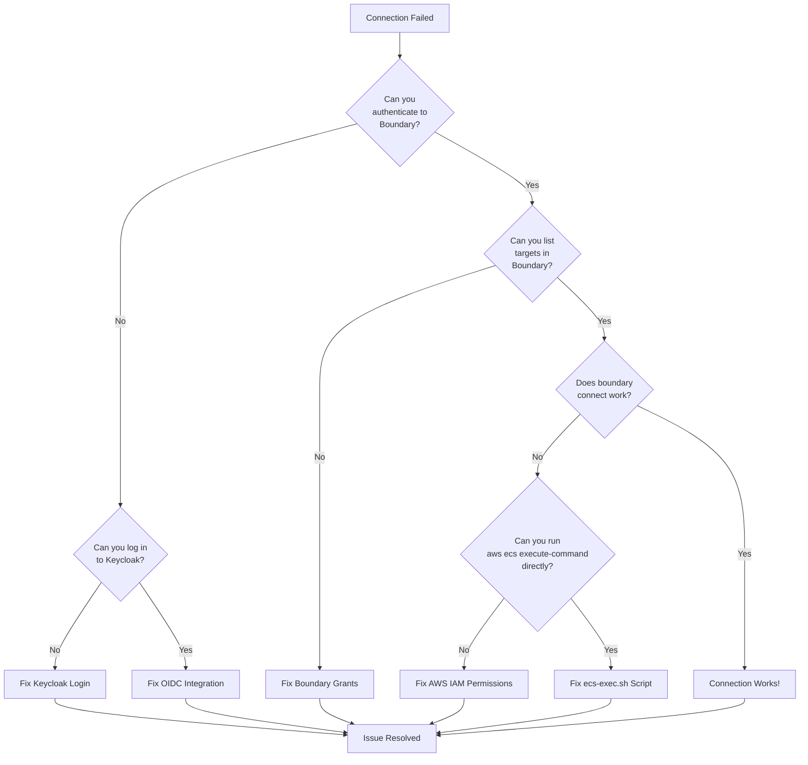

# Troubleshooting Guide

## Overview

This guide provides solutions to common issues when using the Keycloak + HCP Boundary + AWS ECS Fargate zero-trust access system.

## Troubleshooting Decision Tree



## Common Issues by Component

### 1. Keycloak Authentication Issues

#### "Invalid username or password"

**Symptoms:**
- Keycloak login page shows error
- Cannot log into admin console

**Solutions:**

1. Verify credentials:
   ```bash
   # Get admin credentials
   oc get secret keycloak-initial-admin -n keycloak \
     -o jsonpath='{.data.username}' | base64 -d
   oc get secret keycloak-initial-admin -n keycloak \
     -o jsonpath='{.data.password}' | base64 -d
   ```

2. Check Keycloak pod status:
   ```bash
   oc get pods -n keycloak
   oc logs -n keycloak keycloak-0
   ```

3. Verify database connection:
   ```bash
   oc exec keycloak-db-1 -n keycloak -- \
     psql -U postgres -d keycloak -c "SELECT 1"
   ```

#### "Realm not found"

**Symptoms:**
- Keycloak shows "Realm does not exist"
- OIDC discovery URL returns 404

**Solutions:**

1. Check RealmImport status:
   ```bash
   oc get keycloakrealmimport boundary-realm -n keycloak
   oc describe keycloakrealmimport boundary-realm -n keycloak
   ```

2. Verify realm exists:
   ```bash
   # Via API
   ADMIN_TOKEN=$(curl -sk -X POST \
     "$KEYCLOAK_URL/realms/master/protocol/openid-connect/token" \
     -d "client_id=admin-cli" \
     -d "username=$ADMIN_USER" \
     -d "password=$ADMIN_PASS" \
     -d "grant_type=password" | jq -r '.access_token')

   curl -sk -H "Authorization: Bearer $ADMIN_TOKEN" \
     "$KEYCLOAK_URL/admin/realms/rosa-boundary"
   ```

3. Reapply RealmImport:
   ```bash
   oc delete keycloakrealmimport boundary-realm -n keycloak
   oc apply -k deploy/keycloak/overlays/dev
   ```

### 2. Boundary OIDC Issues

#### "auth_time is beyond max_age"

**Symptoms:**
```
Error: id_token failed verification: auth_time is beyond max_age (30): expired auth_time
```

**Root Cause**: Default `max_age` of 30 seconds is too short

**Solution:**

```bash
# Update auth method with longer max_age
boundary auth-methods update oidc \
  -id amoidc_<id> \
  -max-age 3600

# Or via Terraform
max_age = 3600  # 1 hour
```

#### "Invalid signature"

**Symptoms:**
```
Error: id_token failed verification: invalid signature
```

**Solutions:**

1. Check Boundary can reach Keycloak JWKS endpoint:
   ```bash
   curl -sk "https://keycloak-keycloak.apps.rosa.dev.dyee.p3.openshiftapps.com/realms/rosa-boundary/protocol/openid-connect/certs"
   ```

2. Verify signing algorithm:
   ```bash
   # Should be RS256
   boundary auth-methods read -id amoidc_<id> | grep signing_algorithms
   ```

3. Check for clock skew:
   ```bash
   # Boundary and Keycloak clocks must be within ~5 minutes
   date -u
   oc exec keycloak-0 -n keycloak -- date -u
   ```

#### "groups claim not found"

**Symptoms:**
- User authenticates successfully
- No managed group memberships
- Cannot access targets

**Solutions:**

1. Verify groups mapper in Keycloak client:
   ```bash
   # Check protocol mappers
   curl -sk -H "Authorization: Bearer $ADMIN_TOKEN" \
     "$KEYCLOAK_URL/admin/realms/rosa-boundary/clients/<client-uuid>/protocol-mappers/models" | \
     jq '.[] | select(.name=="groups")'
   ```

2. Verify user group membership:
   - Log into Keycloak admin console
   - Users → <username> → Groups tab
   - Ensure user is in at least one group

3. Test ID token contains groups:
   ```bash
   # Decode ID token after authentication
   echo "$ID_TOKEN" | cut -d. -f2 | base64 -d | jq '.groups'
   # Should show array: ["sre-operators"]
   ```

### 3. Boundary Authorization Issues

#### "Permission denied"

**Symptoms:**
```
Error: permission denied
```

**Solutions:**

1. Check managed group memberships:
   ```bash
   boundary accounts list -auth-method-id amoidc_<id>
   boundary managed-groups list -auth-method-id amoidc_<id> -filter '"<user-id>" in "/member_ids"'
   ```

2. Verify role grants:
   ```bash
   boundary roles list -scope-id <scope-id>
   boundary roles read -id r_<role-id>
   ```

3. Check target permissions:
   ```bash
   boundary targets read -id ttcp_<target-id>
   # If you see the target, authorization should work
   ```

4. Verify grant strings include required actions:
   ```
   Grant: ids=*;type=target;actions=authorize-session
   ```

#### "Target not found"

**Symptoms:**
```
Error: target with id ttcp_xxx not found
```

**Solutions:**

1. List all accessible targets:
   ```bash
   boundary targets list -scope-id <project-scope>
   ```

2. Check if target exists (admin only):
   ```bash
   boundary targets read -id ttcp_xxx -scope-id <project-scope>
   ```

3. Verify you're using correct scope ID

### 4. AWS ECS Exec Issues

#### "TargetNotConnectedException"

**Symptoms:**
```
Error: Could not connect to the target. Ensure that SSM Agent is running and the target is reachable.
```

**Root Causes:**
1. Task not running
2. ECS Exec not enabled on task
3. SSM plugin version mismatch

**Solutions:**

1. Check task status:
   ```bash
   aws ecs describe-tasks \
     --cluster rosa-boundary-dev \
     --tasks <task-arn> \
     --query 'tasks[0].[lastStatus,enableExecuteCommand]'
   ```

2. Verify task was launched with `--enable-execute-command`:
   ```bash
   # Check task configuration
   aws ecs describe-tasks \
     --cluster rosa-boundary-dev \
     --tasks <task-id> \
     --query 'tasks[0].enableExecuteCommand'
   ```

3. Check SSM plugin version:
   ```bash
   session-manager-plugin --version
   # Should be >= 1.2.0
   ```

4. Update session-manager-plugin:
   ```bash
   # macOS
   brew install --cask session-manager-plugin

   # Linux
   curl "https://s3.amazonaws.com/session-manager-downloads/plugin/latest/ubuntu_64bit/session-manager-plugin.deb" -o "session-manager-plugin.deb"
   sudo dpkg -i session-manager-plugin.deb
   ```

#### "AccessDeniedException"

**Symptoms:**
```
An error occurred (AccessDeniedException) when calling the ExecuteCommand operation: User: arn:aws:iam::xxx:user/jane is not authorized to perform: ecs:ExecuteCommand on resource: arn:aws:ecs:...
```

**Solutions:**

1. Verify IAM permissions:
   ```bash
   aws iam list-attached-user-policies --user-name jane
   aws iam list-groups-for-user --user-name jane
   ```

2. Test policy simulation:
   ```bash
   aws iam simulate-principal-policy \
     --policy-source-arn "arn:aws:iam::xxx:user/jane" \
     --action-names ecs:ExecuteCommand \
     --resource-arns "arn:aws:ecs:us-east-2:xxx:task/rosa-boundary-dev/abc123"
   ```

3. Verify you're using the correct AWS profile:
   ```bash
   aws sts get-caller-identity
   ```

#### "KMS.AccessDeniedException"

**Symptoms:**
```
Error: kms:GenerateDataKey denied for key arn:aws:kms:...
```

**Solutions:**

1. Check KMS key policy:
   ```bash
   aws kms get-key-policy \
     --key-id alias/rosa-boundary-dev-exec-session \
     --policy-name default
   ```

2. Verify IAM KMS permissions:
   ```bash
   # Check your IAM policies include KMS permissions
   aws iam get-user-policy \
     --user-name jane \
     --policy-name BoundaryKMSDecryptExecSessions
   ```

3. Test KMS access:
   ```bash
   aws kms describe-key \
     --key-id alias/rosa-boundary-dev-exec-session
   ```

### 5. CloudWatch Logs Issues

#### "Session logs not appearing"

**Symptoms:**
- ECS Exec works
- No logs in CloudWatch `/ecs/rosa-boundary-dev/ssm-sessions`

**Solutions:**

1. Verify log group exists:
   ```bash
   aws logs describe-log-groups \
     --log-group-name-prefix "/ecs/rosa-boundary"
   ```

2. Check ECS Exec configuration in task definition:
   ```bash
   aws ecs describe-task-definition \
     --task-definition <family> \
     --query 'taskDefinition.containerDefinitions[0].logConfiguration'
   ```

3. Verify task role has CloudWatch permissions:
   ```bash
   aws iam get-role-policy \
     --role-name rosa-boundary-dev-task-role \
     --policy-name ECSExecCloudWatchLogs
   ```

#### "Access denied reading logs"

**Symptoms:**
```
Error: User is not authorized to perform: logs:GetLogEvents
```

**Solution:**

Attach CloudWatch Logs read policy (see [AWS IAM Policies](../configuration/aws-iam-policies.md#iam-policy-cloudwatch-logs-optional)).

### 6. S3 Audit Sync Issues

#### "S3 sync failed on exit"

**Symptoms:**
- Container exit logs show `aws s3 sync` error
- Audit artifacts not in S3

**Solutions:**

1. Check task role S3 permissions:
   ```bash
   aws iam get-role-policy \
     --role-name rosa-boundary-dev-task-role \
     --policy-name ECSTaskS3Access
   ```

2. Verify S3 bucket exists:
   ```bash
   aws s3 ls | grep rosa-boundary
   ```

3. Check S3_AUDIT_ESCROW or auto-generation variables:
   ```bash
   # In container (if accessible)
   echo $S3_AUDIT_ESCROW
   echo $S3_AUDIT_BUCKET
   echo $CLUSTER_ID
   echo $INCIDENT_NUMBER
   ```

4. Manually sync for testing:
   ```bash
   oc exec keycloak-db-1 -n keycloak -- \
     aws s3 sync /home/sre/ s3://bucket/test/ --dryrun
   ```

## Diagnostic Commands

### Keycloak Diagnostics

```bash
# Check Keycloak pod status
oc get pods -n keycloak

# View Keycloak logs
oc logs -n keycloak keycloak-0 --tail=50

# Check database connectivity
oc exec keycloak-0 -n keycloak -- \
  curl -s http://keycloak-db-rw.keycloak.svc:5432

# Verify OIDC discovery
curl -sk "https://$(oc get route keycloak -n keycloak -o jsonpath='{.spec.host}')/realms/rosa-boundary/.well-known/openid-configuration" | jq '.'
```

### Boundary Diagnostics

```bash
# Check authentication status
boundary authenticate oidc -auth-method-id amoidc_<id>

# List accounts
boundary accounts list -auth-method-id amoidc_<id>

# Check managed group memberships
boundary managed-groups list -auth-method-id amoidc_<id>

# Verify target access
boundary targets list -scope-id <project-scope>
boundary targets read -id ttcp_<target-id>

# View session history
boundary sessions list -scope-id <project-scope>
```

### AWS Diagnostics

```bash
# Verify AWS credentials
aws sts get-caller-identity

# Check ECS cluster
aws ecs describe-clusters --clusters rosa-boundary-dev

# List running tasks
aws ecs list-tasks \
  --cluster rosa-boundary-dev \
  --desired-status RUNNING

# Check task details
aws ecs describe-tasks \
  --cluster rosa-boundary-dev \
  --tasks <task-arn>

# Test ECS Exec directly
aws ecs execute-command \
  --cluster rosa-boundary-dev \
  --task <task-arn> \
  --container rosa-boundary \
  --command "/bin/echo test" \
  --interactive

# Check SSM session logs
aws logs tail /ecs/rosa-boundary-dev/ssm-sessions --follow
```

### Network Diagnostics

```bash
# Test Keycloak reachability
curl -sk https://keycloak-keycloak.apps.rosa.dev.dyee.p3.openshiftapps.com/health

# Test HCP Boundary reachability
curl -sk https://<cluster>.boundary.hashicorp.cloud/health

# Test AWS API reachability
aws sts get-caller-identity --region us-east-2
```

## Error Messages and Solutions

### "Client 'hcp-boundary' not found in realm"

**Cause**: RealmImport not applied or client configuration error

**Solution:**
```bash
oc get keycloakrealmimport boundary-realm -n keycloak
oc describe keycloakrealmimport boundary-realm -n keycloak

# If failed, check logs
oc logs -n keycloak deployment/rhbk-operator | grep -i realm
```

### "Callback URL not allowed"

**Cause**: Redirect URI mismatch between Keycloak client and Boundary

**Solution:**

1. Verify Boundary callback URL:
   ```bash
   boundary auth-methods read -id amoidc_<id> | grep callback_url
   ```

2. Verify Keycloak client redirect URIs include the callback:
   ```bash
   # Should include: https://<boundary>.boundary.hashicorp.cloud/v1/auth-methods/oidc:authenticate:callback
   ```

3. Update KeycloakRealmImport to include correct URLs

### "Task stopped unexpectedly"

**Cause**: Task crashed, OOM, or health check failure

**Solutions:**

1. Check task stopped reason:
   ```bash
   aws ecs describe-tasks \
     --cluster rosa-boundary-dev \
     --tasks <task-arn> \
     --query 'tasks[0].stopCode'
   ```

2. View container logs:
   ```bash
   aws logs tail /ecs/rosa-boundary-dev --follow
   ```

3. Check for OOM events:
   ```bash
   aws ecs describe-tasks \
     --cluster rosa-boundary-dev \
     --tasks <task-arn> \
     --query 'tasks[0].containers[0].reason'
   ```

### "ExternalSecret not syncing"

**Cause**: IAM permissions, SSM parameters missing, or SecretStore misconfigured

**Solutions:**

1. Check ExternalSecret status:
   ```bash
   oc get externalsecret keycloak-db-app -n keycloak
   oc describe externalsecret keycloak-db-app -n keycloak
   ```

2. Verify ClusterSecretStore is ready:
   ```bash
   oc get clustersecretstore aws-ssm-keycloak
   ```

3. Check SSM parameters exist:
   ```bash
   aws ssm get-parameter --name /keycloak/db/username --region us-east-2
   aws ssm get-parameter --name /keycloak/db/password --region us-east-2 --with-decryption
   ```

4. Verify IAM role permissions:
   ```bash
   # Check the external-secrets operator ServiceAccount
   oc get sa external-secrets-operator-controller-manager \
     -n external-secrets-operator \
     -o jsonpath='{.metadata.annotations.eks\.amazonaws\.com/role-arn}'

   # Verify role has SSM and KMS permissions
   aws iam get-role-policy \
     --role-name dev-keycloak \
     --policy-name AllAllParameters
   ```

## Logs Collection

For support requests, collect these logs:

```bash
#!/bin/bash
# collect-logs.sh

OUTPUT_DIR="boundary-debug-$(date +%Y%m%d-%H%M%S)"
mkdir -p "$OUTPUT_DIR"

# Keycloak
oc logs -n keycloak keycloak-0 > "$OUTPUT_DIR/keycloak.log"
oc get keycloak keycloak -n keycloak -o yaml > "$OUTPUT_DIR/keycloak-cr.yaml"
oc get keycloakrealmimport -n keycloak -o yaml > "$OUTPUT_DIR/realm-import.yaml"

# Boundary (metadata only, no sensitive data)
boundary auth-methods read -id amoidc_<id> > "$OUTPUT_DIR/boundary-auth-method.txt"
boundary targets list -scope-id <scope> > "$OUTPUT_DIR/boundary-targets.txt"
boundary sessions list -scope-id <scope> > "$OUTPUT_DIR/boundary-sessions.txt"

# AWS
aws ecs describe-tasks \
  --cluster rosa-boundary-dev \
  --tasks <task-arn> > "$OUTPUT_DIR/ecs-task.json"

aws logs tail /ecs/rosa-boundary-dev/ssm-sessions \
  --since 1h > "$OUTPUT_DIR/ssm-sessions.log"

# Environment
boundary version > "$OUTPUT_DIR/versions.txt"
aws --version >> "$OUTPUT_DIR/versions.txt"
oc version >> "$OUTPUT_DIR/versions.txt"

tar czf "$OUTPUT_DIR.tar.gz" "$OUTPUT_DIR"
echo "Logs collected in $OUTPUT_DIR.tar.gz"
```

## Performance Issues

### Slow Keycloak login

1. Check PostgreSQL performance:
   ```bash
   oc exec keycloak-db-1 -n keycloak -- \
     psql -U postgres -d keycloak -c "SELECT * FROM pg_stat_activity WHERE state = 'active';"
   ```

2. Consider scaling CNPG:
   ```bash
   oc patch cluster keycloak-db -n keycloak --type merge -p '{"spec":{"instances":3}}'
   ```

### Slow Boundary authentication

1. Check HCP Boundary status page: https://status.hashicorp.com
2. Test Keycloak JWKS endpoint latency
3. Verify network path to HCP (no proxies blocking)

### Slow ECS Exec connection

1. Check SSM service status
2. Verify ECS task health
3. Test network latency to AWS region

## Escalation Paths

| Issue Type | Contact | SLA |
|------------|---------|-----|
| Keycloak auth | Identity Team | 1 hour |
| Boundary access | Security Team | 2 hours |
| AWS infrastructure | Cloud Team | 1 hour |
| Container tools | Platform Team | 4 hours |

## Known Limitations

1. **No dynamic ECS discovery**: Targets must be created manually per-incident
2. **No session recording**: Only metadata logged in Boundary (full session logs in CloudWatch)
3. **No credential brokering**: Users must have AWS IAM credentials
4. **Max 10,000 incidents**: EFS access point limit per filesystem
5. **Single region**: Current deployment in us-east-2 only

For architectural limitations, see [Session Flow](../architecture/session-flow.md#comparison-traditional-vs--exec-integration).

## Additional Resources

- [User Access Guide](user-access-guide.md) - End-user instructions
- [Incident Workflow](incident-workflow.md) - Full incident lifecycle
- [Boundary Documentation](https://developer.hashicorp.com/boundary/docs)
- [Keycloak Documentation](https://www.keycloak.org/documentation)
- [AWS ECS Exec](https://docs.aws.amazon.com/AmazonECS/latest/developerguide/ecs-exec.html)
