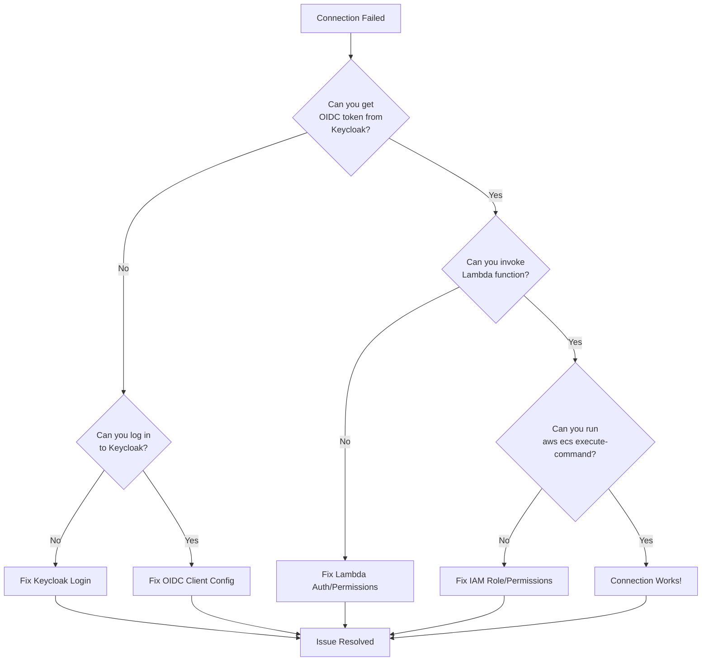

# Troubleshooting Guide

## Overview

This guide provides solutions to common issues when using the Keycloak + AWS Lambda + ECS Fargate access system.

## Troubleshooting Decision Tree



## Common Issues by Component

### 1. Keycloak Authentication Issues

#### "Invalid username or password"

**Symptoms:**
- Keycloak login page shows error
- Cannot log into admin console

**Solutions:**

1. Verify credentials:
   ```bash
   # Get admin credentials
   oc get secret keycloak-initial-admin -n keycloak \
     -o jsonpath='{.data.username}' | base64 -d
   oc get secret keycloak-initial-admin -n keycloak \
     -o jsonpath='{.data.password}' | base64 -d
   ```

2. Check Keycloak pod status:
   ```bash
   oc get pods -n keycloak
   oc logs -n keycloak keycloak-0
   ```

3. Verify database connection:
   ```bash
   oc exec keycloak-db-1 -n keycloak -- \
     psql -U postgres -d keycloak -c "SELECT 1"
   ```

#### "Realm not found"

**Symptoms:**
- Keycloak shows "Realm does not exist"
- OIDC discovery URL returns 404

**Solutions:**

1. Check RealmImport status:
   ```bash
   oc get keycloakrealmimport boundary-realm -n keycloak
   oc describe keycloakrealmimport boundary-realm -n keycloak
   ```

2. Verify realm exists via API:
   ```bash
   KEYCLOAK_URL="https://$(oc get route keycloak -n keycloak -o jsonpath='{.spec.host}')"
   curl -I "$KEYCLOAK_URL/realms/rosa-boundary/.well-known/openid-configuration"
   ```

3. Reapply RealmImport:
   ```bash
   oc delete keycloakrealmimport boundary-realm -n keycloak
   oc apply -k deploy/keycloak/overlays/dev
   ```

#### "User not found in group"

**Symptoms:**
- Can log in to Keycloak but Lambda denies access
- Lambda returns "User is not a member of sre-team group"

**Solutions:**

1. Check user's group membership in Keycloak admin console
2. Verify groups claim in ID token:
   ```bash
   cd tools/sre-auth
   TOKEN=$(./get-oidc-token.sh)
   echo $TOKEN | cut -d. -f2 | base64 -d 2>/dev/null | jq '.groups'
   ```

3. Add user to `sre-team` group in Keycloak

### 2. OIDC Token Issues

#### "Token signature verification failed"

**Symptoms:**
- Lambda rejects OIDC token
- Error: "Invalid token signature"

**Solutions:**

1. Check JWKS endpoint is accessible:
   ```bash
   curl "$KEYCLOAK_ISSUER_URL/protocol/openid-connect/certs"
   ```

2. Verify issuer URL matches:
   ```bash
   # Check token issuer claim
   TOKEN=$(tools/sre-auth/get-oidc-token.sh)
   echo $TOKEN | cut -d. -f2 | base64 -d 2>/dev/null | jq '.iss'
   ```

3. Regenerate token:
   ```bash
   cd tools/sre-auth
   ./get-oidc-token.sh --force
   ```

#### "Token expired"

**Symptoms:**
- "Token has expired" error from Lambda
- Old cached token

**Solutions:**

1. Clear token cache:
   ```bash
   rm -f ~/.sre-auth/id-token.cache
   ```

2. Get fresh token:
   ```bash
   cd tools/sre-auth
   ./get-oidc-token.sh --force
   ```

### 3. Lambda Function Issues

#### "AccessDenied" when invoking Lambda

**Symptoms:**
- Cannot invoke Lambda function URL
- HTTP 403 Forbidden

**Solutions:**

1. Verify Lambda function URL:
   ```bash
   aws lambda get-function-url-config \
     --function-name rosa-boundary-dev-create-investigation
   ```

2. Check OIDC token is valid and has correct audience
3. Verify Lambda auth type is `AWS_IAM_OIDC`

#### "User is not a member of required group"

**Symptoms:**
- Lambda returns 403 with group membership error
- User authenticated but not authorized

**Solutions:**

1. Verify you're in `sre-team` group (see "User not found in group" above)
2. Check Lambda code for required group name
3. Contact administrator to add you to the group

#### "Lambda timeout" or "No response"

**Symptoms:**
- Long delay then timeout error
- No response from Lambda

**Solutions:**

1. Check Lambda logs:
   ```bash
   aws logs tail /aws/lambda/rosa-boundary-dev-create-investigation --follow
   ```

2. Verify Lambda has network access to ECS/IAM/EFS APIs
3. Check Lambda execution role permissions

### 4. AWS IAM Role Issues

#### "AccessDenied" when assuming role

**Symptoms:**
- `aws sts assume-role-with-web-identity` fails
- Cannot assume returned IAM role

**Solutions:**

1. Verify OIDC provider trust relationship:
   ```bash
   aws iam get-role --role-name rosa-boundary-dev-user-<sub>
   ```

2. Check OIDC provider exists:
   ```bash
   aws iam list-open-id-connect-providers
   aws iam get-open-id-connect-provider --open-id-connect-provider-arn <arn>
   ```

3. Verify thumbprint matches Keycloak certificate

#### "AccessDenied" when executing ECS command

**Symptoms:**
- Role assumed successfully but ECS Exec fails
- "User is not authorized to perform: ecs:ExecuteCommand"

**Solutions:**

1. Check task tags match your owner_sub:
   ```bash
   aws ecs describe-tasks \
     --cluster rosa-boundary-dev \
     --tasks <task-arn> \
     --query 'tasks[0].tags'
   ```

2. Verify IAM role policy has tag-based condition:
   ```bash
   aws iam get-role-policy \
     --role-name rosa-boundary-dev-user-<sub> \
     --policy-name ExecuteCommandOnOwnedTasks
   ```

3. Ensure you're using the correct role (check `aws sts get-caller-identity`)

### 5. ECS Task Issues

#### "Task not found"

**Symptoms:**
- Task ARN returned by Lambda doesn't exist
- `aws ecs describe-tasks` returns empty

**Solutions:**

1. Verify task ARN is correct
2. Check task didn't fail to start:
   ```bash
   aws ecs describe-tasks \
     --cluster rosa-boundary-dev \
     --tasks <task-arn> \
     --query 'tasks[0].{lastStatus:lastStatus,stopCode:stopCode,stoppedReason:stoppedReason}'
   ```

3. Check CloudWatch logs for task startup errors:
   ```bash
   aws logs tail /ecs/rosa-boundary-dev --follow
   ```

#### "Task stopped unexpectedly"

**Symptoms:**
- Task was running but now stopped
- Connection dropped mid-session

**Solutions:**

1. Check stop reason:
   ```bash
   aws ecs describe-tasks \
     --cluster rosa-boundary-dev \
     --tasks <task-arn> \
     --query 'tasks[0].{stopCode:stopCode,stoppedReason:stoppedReason,exitCode:containers[0].exitCode}'
   ```

2. Check CloudWatch logs for errors
3. Verify EFS mount succeeded
4. Check for resource limits (CPU/memory)

#### "ECS Exec not enabled"

**Symptoms:**
- "Execute command failed: enable-execute-command is not enabled"

**Solutions:**

1. Verify task was launched with `--enable-execute-command`:
   ```bash
   aws ecs describe-tasks \
     --cluster rosa-boundary-dev \
     --tasks <task-arn> \
     --query 'tasks[0].enableExecuteCommand'
   ```

2. If false, this is a Lambda bug - contact administrator
3. As workaround, use manual scripts to launch task:
   ```bash
   cd deploy/regional/examples
   ./launch_task.sh <task-family>
   ```

### 6. Network and Connectivity Issues

#### "Cannot reach Keycloak"

**Symptoms:**
- Timeout connecting to Keycloak
- DNS resolution fails

**Solutions:**

1. Check Keycloak route:
   ```bash
   oc get route keycloak -n keycloak
   curl -I https://$(oc get route keycloak -n keycloak -o jsonpath='{.spec.host}')
   ```

2. Verify DNS resolves:
   ```bash
   nslookup keycloak-keycloak.apps.rosa.dev.dyee.p3.openshiftapps.com
   ```

3. Check OpenShift cluster is accessible:
   ```bash
   oc whoami
   oc cluster-info
   ```

#### "SSM session failed to start"

**Symptoms:**
- ECS Exec authorized but SSM connection fails
- "Failed to start session" error

**Solutions:**

1. Verify SSM agent is running in container:
   ```bash
   aws logs tail /ecs/rosa-boundary-dev --follow
   # Look for "Successfully registered with SSM"
   ```

2. Check KMS key permissions:
   ```bash
   aws kms describe-key --key-id <key-id>
   ```

3. Verify task has SSM IAM permissions

## Diagnostic Commands

### Keycloak Diagnostics

```bash
# Get Keycloak status
oc get pods -n keycloak
oc get keycloak -n keycloak

# Check database
oc get cluster -n keycloak
oc exec keycloak-db-1 -n keycloak -- psql -U postgres -l

# Test OIDC endpoints
KEYCLOAK_URL="https://$(oc get route keycloak -n keycloak -o jsonpath='{.spec.host}')"
curl "$KEYCLOAK_URL/realms/rosa-boundary/.well-known/openid-configuration"
curl "$KEYCLOAK_URL/realms/rosa-boundary/protocol/openid-connect/certs"
```

### Lambda Diagnostics

```bash
# Get Lambda configuration
aws lambda get-function-configuration \
  --function-name rosa-boundary-dev-create-investigation

# Get Lambda URL
aws lambda get-function-url-config \
  --function-name rosa-boundary-dev-create-investigation

# Check Lambda logs
aws logs tail /aws/lambda/rosa-boundary-dev-create-investigation --follow

# Test Lambda invocation (requires valid token)
curl -X POST "<lambda-url>" \
  -H "Authorization: Bearer $(tools/sre-auth/get-oidc-token.sh)" \
  -H "Content-Type: application/json" \
  -d '{"cluster_id":"test","investigation_id":"test","oc_version":"4.20"}'
```

### IAM Diagnostics

```bash
# List OIDC providers
aws iam list-open-id-connect-providers

# Get provider details
aws iam get-open-id-connect-provider \
  --open-id-connect-provider-arn <arn>

# Get role details
aws iam get-role --role-name rosa-boundary-dev-user-<sub>

# List role policies
aws iam list-role-policies --role-name rosa-boundary-dev-user-<sub>

# Get policy document
aws iam get-role-policy \
  --role-name rosa-boundary-dev-user-<sub> \
  --policy-name ExecuteCommandOnOwnedTasks
```

### ECS Diagnostics

```bash
# List tasks
aws ecs list-tasks --cluster rosa-boundary-dev

# Describe task
aws ecs describe-tasks \
  --cluster rosa-boundary-dev \
  --tasks <task-arn>

# Get task logs
aws logs tail /ecs/rosa-boundary-dev --follow

# Check SSM session logs
aws logs tail /ecs/rosa-boundary-dev/ssm-sessions --follow

# Test ECS Exec directly
aws ecs execute-command \
  --cluster rosa-boundary-dev \
  --task <task-arn> \
  --container rosa-boundary \
  --interactive \
  --command "/bin/bash"
```

## Error Messages and Solutions

### "invalid_grant: Code not valid"

**Cause:** PKCE authorization code already used or expired

**Solution:**
```bash
cd tools/sre-auth
./get-oidc-token.sh --force
```

### "Unauthorized: Invalid token"

**Cause:** Token signature invalid or issuer mismatch

**Solution:**
1. Verify `KEYCLOAK_ISSUER_URL` is correct
2. Check JWKS endpoint is accessible
3. Regenerate token

### "Task definition not found"

**Cause:** Lambda failed to create task definition or it was deleted

**Solution:**
1. Check Lambda logs for errors
2. List task definitions:
   ```bash
   aws ecs list-task-definitions --family-prefix rosa-boundary-dev
   ```
3. Re-run investigation creation

### "EFS mount failed"

**Cause:** EFS access point doesn't exist or network issue

**Solution:**
1. Verify access point exists:
   ```bash
   aws efs describe-access-points \
     --file-system-id <fs-id>
   ```
2. Check security groups allow NFS (port 2049)
3. Verify subnets have EFS mount targets

## Logs Collection

### Collect full diagnostic bundle

```bash
#!/bin/bash
BUNDLE_DIR="rosa-boundary-diagnostics-$(date +%Y%m%d-%H%M%S)"
mkdir -p "$BUNDLE_DIR"

# Keycloak logs
oc logs -n keycloak keycloak-0 > "$BUNDLE_DIR/keycloak.log"
oc get keycloak -n keycloak -o yaml > "$BUNDLE_DIR/keycloak-cr.yaml"

# Lambda logs (last 1 hour)
aws logs filter-log-events \
  --log-group-name /aws/lambda/rosa-boundary-dev-create-investigation \
  --start-time $(($(date +%s) * 1000 - 3600000)) \
  > "$BUNDLE_DIR/lambda-logs.json"

# ECS logs
aws logs tail /ecs/rosa-boundary-dev --since 1h \
  > "$BUNDLE_DIR/ecs-task-logs.txt"

# Task details
aws ecs describe-tasks \
  --cluster rosa-boundary-dev \
  --tasks <task-arn> \
  > "$BUNDLE_DIR/ecs-task-details.json"

tar -czf "$BUNDLE_DIR.tar.gz" "$BUNDLE_DIR"
echo "Diagnostic bundle: $BUNDLE_DIR.tar.gz"
```

## Performance Issues

### "Slow OIDC authentication"

**Causes:**
- Network latency to Keycloak
- Keycloak database performance

**Solutions:**
1. Check Keycloak pod CPU/memory
2. Scale PostgreSQL if needed
3. Use token caching (automatic in get-oidc-token.sh)

### "Slow Lambda invocation"

**Causes:**
- Lambda cold start
- Network latency
- IAM API throttling

**Solutions:**
1. Check Lambda duration in CloudWatch metrics
2. Increase Lambda memory if needed
3. Use provisioned concurrency for critical times

### "Slow ECS Exec connection"

**Causes:**
- SSM agent startup delay
- Network latency
- KMS key throttling

**Solutions:**
1. Wait 10-15 seconds after task reaches RUNNING
2. Check CloudWatch metrics for SSM latency
3. Use keep-alive script for long sessions

## Escalation Paths

### Keycloak Issues
1. Check Keycloak operator logs
2. Review RHBK documentation
3. Contact OpenShift support

### Lambda Issues
1. Check CloudWatch Logs
2. Review Lambda execution role
3. Contact AWS support

### IAM/Permission Issues
1. Verify OIDC provider configuration
2. Review IAM role policies
3. Contact AWS administrators

### ECS/Container Issues
1. Check task definition
2. Review CloudWatch Logs
3. Test container locally with podman

## Known Limitations

1. **EFS Access Point Limit**: Maximum 10,000 access points per filesystem
2. **Token Cache Duration**: OIDC tokens cached for 4 minutes
3. **IAM Role Limit**: Soft limit of 1000 roles per account (one per user)
4. **Task Definition Limit**: 1,000,000 revisions per family (shouldn't be reached)
5. **SSM Session Limit**: 25 concurrent sessions per instance (Fargate tasks)

## Additional Resources

- [Keycloak Realm Setup](../configuration/keycloak-realm-setup.md) - OIDC client configuration
- [AWS IAM Policies](../configuration/aws-iam-policies.md) - IAM role policies
- [User Access Guide](user-access-guide.md) - End-user workflow
- [Investigation Workflow](investigation-workflow.md) - Admin workflow
