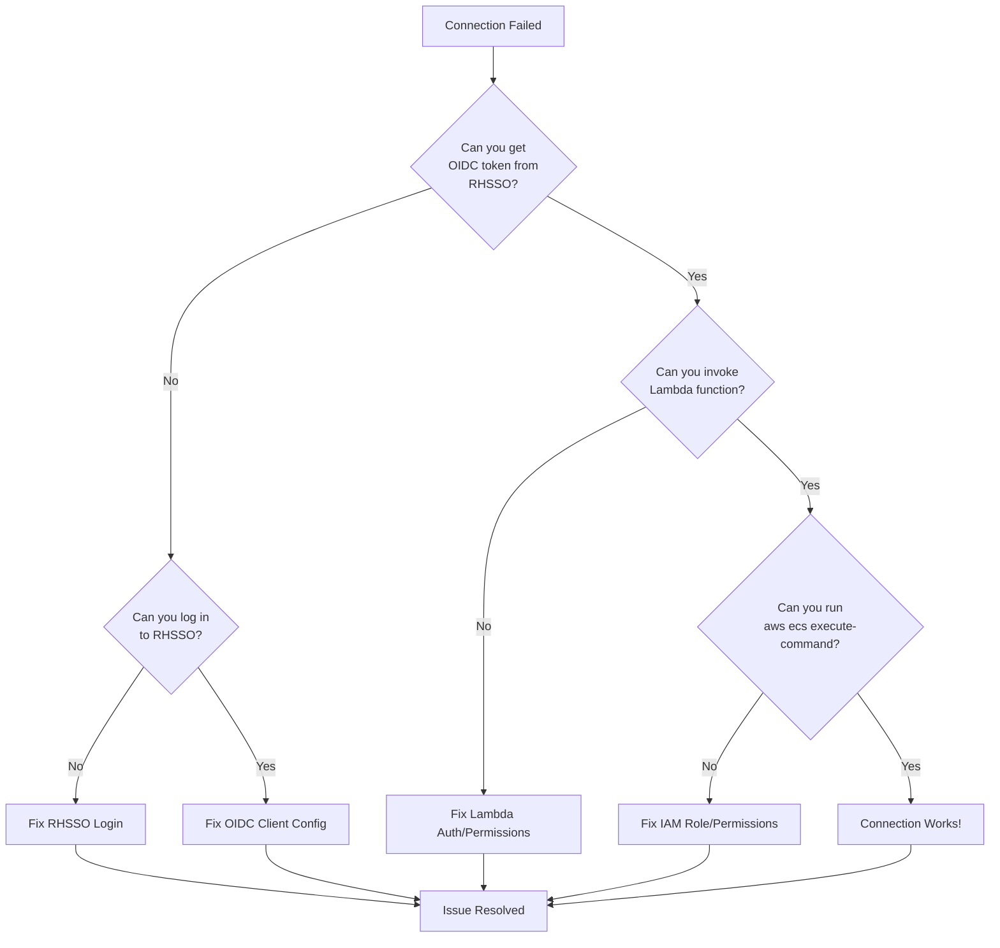

# Troubleshooting Guide

## Overview

This guide provides solutions to common issues when using the RHSSO + AWS Lambda + ECS Fargate access system.

## Troubleshooting Decision Tree


```mermaid
flowchart TD
    Start[Connection Failed] --> Auth{Can you get<br/>OIDC token from<br/>RHSSO?}

    Auth -->|No| IDP{Can you log in<br/>to RHSSO?}
    Auth -->|Yes| Lambda{Can you invoke<br/>Lambda function?}

    IDP -->|No| IDP_Fix[Fix RHSSO Login]
    IDP -->|Yes| OIDC_Fix[Fix OIDC Client Config]

    Lambda -->|No| Lambda_Fix[Fix Lambda Auth/Permissions]
    Lambda -->|Yes| AWS{Can you run<br/>aws ecs execute-command?}

    AWS -->|No| IAM_Fix[Fix IAM Role/Permissions]
    AWS -->|Yes| Success[Connection Works!]

    IDP_Fix --> End[Issue Resolved]
    OIDC_Fix --> End
    Lambda_Fix --> End
    IAM_Fix --> End
    Success --> End
```

## Common Issues by Component

### 1. RHSSO Authentication Issues

#### "Authentication failed" in OIDC flow

**Symptoms:**
- Browser login fails or redirect doesn't complete
- `rosa-boundary login` returns an error

**Solutions:**

1. Verify RHSSO is accessible and discovery endpoint returns:
   ```bash
   curl -s "${ROSA_BOUNDARY_OIDC_ISSUER_URL}/.well-known/openid-configuration" | jq '.jwks_uri'
   ```

2. Verify your account is active and in the `sre-team` group:
   - Contact the identity team

3. Force fresh authentication:
   ```bash
   rosa-boundary login --force
   ```

#### "User not found in group"

**Symptoms:**
- Can log in to RHSSO but Lambda denies access
- Lambda returns "User is not a member of sre-team group"

**Solutions:**

1. Verify the `groups` claim is present in the OIDC token:
   ```bash
   TOKEN=$(rosa-boundary login)
   echo $TOKEN | cut -d. -f2 | base64 -d 2>/dev/null | jq '.groups'
   ```

2. Contact the identity team to add you to the `sre-team` group

### 2. OIDC Token Issues

#### "Token signature verification failed"

**Symptoms:**
- Lambda rejects OIDC token
- Error: "Invalid token signature"

**Solutions:**

1. Check JWKS endpoint is accessible (Lambda fetches this via OIDC discovery):
   ```bash
   DISCOVERY=$(curl -s "${ROSA_BOUNDARY_OIDC_ISSUER_URL}/.well-known/openid-configuration")
   JWKS_URI=$(echo $DISCOVERY | jq -r '.jwks_uri')
   curl -s "$JWKS_URI" | jq '.keys | length'
   ```

2. Verify issuer URL matches what's configured for the Lambda:
   ```bash
   # Check token issuer claim
   TOKEN=$(rosa-boundary login)
   echo $TOKEN | cut -d. -f2 | base64 -d 2>/dev/null | jq '.iss'
   ```

3. Regenerate token:
   ```bash
   rosa-boundary login --force
   ```

#### "Token expired"

**Symptoms:**
- "Token has expired" error from Lambda
- Old cached token

**Solutions:**

1. Clear token cache:
   ```bash
   rm -rf ~/.cache/rosa-boundary/
   ```

2. Get fresh token:
   ```bash
   rosa-boundary login --force
   ```

### 3. Lambda Function Issues

#### "AccessDenied" when invoking Lambda

**Symptoms:**
- Cannot invoke Lambda function
- HTTP 403 Forbidden

**Solutions:**

1. Verify Lambda function name:
   ```bash
   aws lambda get-function \
     --function-name rosa-boundary-dev-create-investigation \
     --query 'Configuration.FunctionName'
   ```

2. Check OIDC token is valid and has correct audience
3. Verify invoker role trust policy includes your OIDC provider

#### "User is not a member of required group"

**Symptoms:**
- Lambda returns 403 with group membership error
- User authenticated but not authorized

**Solutions:**

1. Verify you're in `sre-team` group (see "User not found in group" above)
2. Check Lambda code for required group name
3. Contact administrator to add you to the group

#### "Lambda timeout" or "No response"

**Symptoms:**
- Long delay then timeout error
- No response from Lambda

**Solutions:**

1. Check Lambda logs:
   ```bash
   aws logs tail /aws/lambda/rosa-boundary-dev-create-investigation --follow
   ```

2. Verify Lambda has network access to ECS/IAM/EFS APIs
3. Check Lambda execution role permissions
4. Verify RHSSO OIDC discovery endpoint is reachable from Lambda's VPC/network

### 4. AWS IAM Role Issues

#### "AccessDenied" when assuming role

**Symptoms:**
- `AssumeRoleWithWebIdentity` fails
- Cannot assume returned IAM role

**Solutions:**

1. Check OIDC provider exists:
   ```bash
   aws iam list-open-id-connect-providers
   aws iam get-open-id-connect-provider --open-id-connect-provider-arn <arn>
   ```

2. Verify thumbprint matches the RHSSO TLS certificate

3. Check invoker role trust policy allows your OIDC provider and client ID

#### "AccessDenied" when executing ECS command

**Symptoms:**
- Role assumed successfully but ECS Exec fails
- "User is not authorized to perform: ecs:ExecuteCommand"

**Solutions:**

1. Check task tags match your username:
   ```bash
   aws ecs describe-tasks \
     --cluster rosa-boundary-dev \
     --tasks <task-arn> \
     --query 'tasks[0].tags'
   ```

2. Verify IAM role policy has tag-based condition:
   ```bash
   aws iam get-role-policy \
     --role-name rosa-boundary-dev-sre-shared \
     --policy-name ExecuteCommandOnOwnedTasks
   ```

3. Ensure you're using the correct role (check `aws sts get-caller-identity`)

### 5. ECS Task Issues

#### "Task not found"

**Symptoms:**
- Task ARN returned by Lambda doesn't exist
- `aws ecs describe-tasks` returns empty

**Solutions:**

1. Verify task ARN is correct
2. Check task didn't fail to start:
   ```bash
   aws ecs describe-tasks \
     --cluster rosa-boundary-dev \
     --tasks <task-arn> \
     --query 'tasks[0].{lastStatus:lastStatus,stopCode:stopCode,stoppedReason:stoppedReason}'
   ```

3. Check CloudWatch logs for task startup errors:
   ```bash
   aws logs tail /ecs/rosa-boundary-dev --follow
   ```

#### "Task stopped unexpectedly"

**Symptoms:**
- Task was running but now stopped
- Connection dropped mid-session

**Solutions:**

1. Check stop reason:
   ```bash
   aws ecs describe-tasks \
     --cluster rosa-boundary-dev \
     --tasks <task-arn> \
     --query 'tasks[0].{stopCode:stopCode,stoppedReason:stoppedReason,exitCode:containers[0].exitCode}'
   ```

2. Check CloudWatch logs for errors
3. Verify EFS mount succeeded
4. Check for resource limits (CPU/memory)
5. Verify task deadline tag — the reaper Lambda stops tasks when `now > deadline` (tag: `deadline`, ISO 8601)

#### "ECS Exec not enabled"

**Symptoms:**
- "Execute command failed: enable-execute-command is not enabled"

**Solutions:**

1. Verify task was launched with `--enable-execute-command`:
   ```bash
   aws ecs describe-tasks \
     --cluster rosa-boundary-dev \
     --tasks <task-arn> \
     --query 'tasks[0].enableExecuteCommand'
   ```

2. If false, this task was not launched via the investigation Lambda. Create a new investigation.

### 6. SSM Session Issues

#### "Session Manager plugin not found"

**Symptoms:**
- `SessionManagerPlugin is not found` error
- `join-task` fails immediately

**Solutions:**

1. Install session-manager-plugin:
   ```bash
   # macOS
   brew install --cask session-manager-plugin

   # Linux
   curl "https://s3.amazonaws.com/session-manager-downloads/plugin/latest/linux_64bit/session-manager-plugin.rpm" -o ssm.rpm
   sudo rpm -U ssm.rpm
   ```

2. Verify it's in PATH:
   ```bash
   which session-manager-plugin
   ```

## General Debugging Commands

```bash
# Check rosa-boundary config
rosa-boundary configure --help

# Verify OIDC discovery
curl -s "${ROSA_BOUNDARY_OIDC_ISSUER_URL}/.well-known/openid-configuration" | jq '{issuer, jwks_uri, authorization_endpoint}'

# List running tasks
rosa-boundary list-tasks

# Check AWS identity
aws sts get-caller-identity

# Tail Lambda logs
aws logs tail /aws/lambda/rosa-boundary-dev-create-investigation --follow

# Check ECS task status
aws ecs describe-tasks \
  --cluster rosa-boundary-dev \
  --tasks <task-arn>
```
