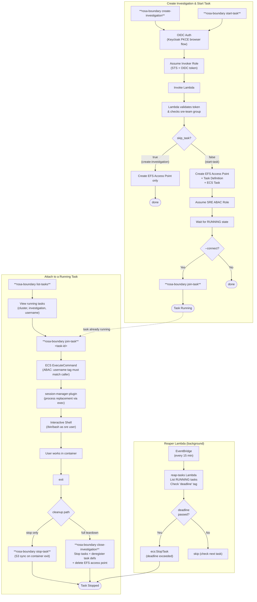

# CLI Workflow Flowcharts

This document shows the end-to-end flows for common rosa-boundary CLI operations. All OIDC-authenticated paths require a valid Keycloak token; the two-step role assumption (invoker role → SRE ABAC role) is transparent to the user.

