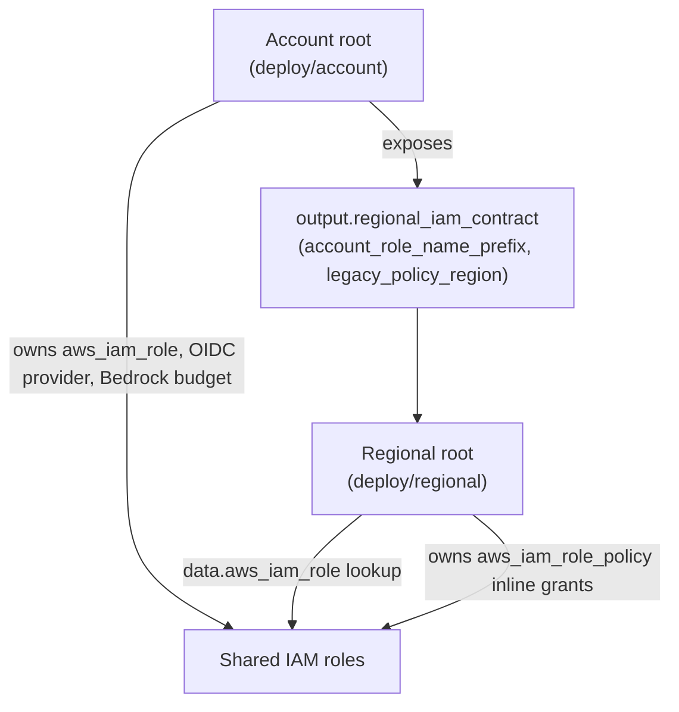

# Testing and verification strategy

The repository uses several test layers because no single environment covers the CLI, container scripts, Terraform policy shape, cross-root Terraform ownership, Lambda logic, and AWS API interactions. Go and Python unit tests isolate logic; bats tests exercise shell behavior; Terraform tests use a mocked provider for input constraints and, increasingly, for ownership contracts between the account and regional roots; LocalStack tests exercise service APIs and relationships between AWS resources. Prow's `tests/localstack/ci-run.sh` adds service/readiness gates, Docker-compatible ECS task execution, JUnit artifacts, and failure logs around the LocalStack suite.

## Unit and focused tests

- **Go CLI and libraries:** `make test-cli` runs `go test ./...`. Tests cover OIDC callback/PKCE and token cache behavior, command validation and role selection, AWS wrapper logic, Lambda invocation, and OCM credential transfer.
- **Investigation Lambda:** `make test-lambda-create-investigation` runs its pytest handler tests; they exercise request validation, OIDC/group authorization, error sanitization, investigation resource creation, and handover behavior with mocked AWS clients.
- **Reaper Lambda:** `make test-lambda-reap-tasks` runs its unittest handler suite, covering deadline parsing, stop errors, pagination, and task processing, plus session-aware reaping: active SSM Session Manager sessions protect a task from being stopped, tasks with no active session are reaped as before, and SSM `DescribeSessions` failures are recorded as per-task errors ("fail closed") without blocking other tasks. `make test-lambda` combines the two Lambda suites.
- **Shell:** the bats suites under `tests/shell/` source the entrypoint and credential helper and stub external commands to verify mount checks, cleanup, sync exclusions, input validation, and credential error handling without launching a container.
- **Build helper:** `make test-github-dl` runs tests for GitHub release download authentication, checksum validation, and build secret resolution.
- **Terraform:** `deploy/regional/tests/claude_default_model.tftest.hcl` and `deploy/regional/tests/iam-ownership.tftest.hcl` use `mock_provider "aws"` against the regional root; `deploy/account/tests/baseline.tftest.hcl` and `deploy/account/tests/shared-iam.tftest.hcl` do the same against the account root and its `shared-iam` module. None of the four suites make live AWS calls.

## Terraform test suites and cross-root ownership

Identity now has two Terraform roots: the account root owns the shared IAM roles, the Bedrock account budget, and the OIDC provider(s) once per AWS account, while the regional root looks those roles up by name with `data.aws_iam_role` and attaches region-scoped inline policies to them. Because the split moved real resources into one root and data-source lookups into the other, the Terraform test suites now have to validate not just a single root's input constraints but the ownership contract between the two roots — that the account root is the only owner of role/attachment resources and that the regional root never creates or releases those roles, only the inline policies attached to them.

*How the account root's shared identities and contract output are consumed, not re-created, by the regional root's inline policies.*

### Account root: `baseline.tftest.hcl`

This suite mocks `aws_partition`, `aws_caller_identity`, and `aws_bedrock_foundation_model_agreement_offers` and never calls live AWS. Its `apply`-mode runs assert account-level singletons: the eight shared role outputs (including a `null` `s3_replication` entry when replication is disabled), the Bedrock monthly budget with its three notification thresholds (50/80/100 percent) addressed to the configured alert email and tagged with the original `Region` value, and the primary Keycloak OIDC provider together with optional stage/prod OIDC providers gated by their own variables. It also asserts the `regional_iam_contract` output carries exactly the account role name prefix and legacy policy region that regional roots are expected to consume. Because mocked AWS calls cannot enforce that the account root stays decoupled from regional infrastructure, several assertions instead grep the account root's own `.tf` files to confirm it declares no `aws_iam_role_policy` resources, no dependency on regional remote state or regional resource ARNs, and no `aws_iam_role_policies_exclusive`/`aws_iam_role_policy_attachments_exclusive` reconciliation that would let the account root delete grants it does not own. Separate `plan`-mode runs check role-name-prefix length limits (a 64-character IAM role name ceiling), rejection of invalid or wildcard inputs, and that explicit approval is required before a Bedrock model agreement or an added Bedrock logging source region takes effect.

### Account root: `shared-iam.tftest.hcl`

This suite exercises the `./modules/shared-iam` module directly. It asserts that all eight legacy role names survive migration unchanged, that the SRE-shared and Lambda-invoker roles share an identical trust policy with one `Statement` entry per configured Keycloak issuer (primary, stage, and prod), each scoped to its own audience claim and both requiring the `ai-sd-sre` role tag and the configured UUID allowlist via `sts:TagSession` conditions, and that session duration differs by role (7200 seconds for the SRE-shared role versus the default 3600 seconds for the Lambda invoker). Further assertions confirm service-trust policies for ECS, Lambda, S3, and Bedrock logging roles, Bedrock's confused-deputy `aws:SourceAccount`/`aws:SourceArn` condition pair (extended correctly across multiple approved logging source regions in one run), shared managed-policy attachments owned exactly once, and consistent `Region`/`Project`/`Stage`/`ManagedBy`/`Owner` tags across all role resources. A dedicated `plan`-mode run confirms an empty UUID allowlist fails closed by rejecting the SRE-shared role's trust policy outright rather than falling back to an unrestricted condition.

### Regional root: `iam-ownership.tftest.hcl`

This suite mocks `data.aws_iam_role` and `data.aws_iam_openid_connect_provider` (returning a fixed shared-role ARN/ID) alongside `aws_lambda_function`, `aws_cloudwatch_event_rule`, `aws_s3_bucket`, `aws_ecs_cluster`, `aws_efs_file_system`, `aws_kms_key`, and `aws_cloudwatch_log_group`, so the regional root's inline policies render against role lookups rather than regionally-owned roles. Its primary `apply` run asserts that all thirteen legacy inline-policy identities keep their original names and scopes, that every `aws_iam_role_policy` attaches to a role obtained through `data.aws_iam_role` (never a role the regional root creates), and that the regional `.tf` files themselves contain no `aws_iam_role`, `aws_iam_role_policy_attachment`, or `aws_iam_openid_connect_provider` resources and no exclusive-reconciliation resources that could delete grants outside the regional root's control. It separately verifies the reaper and ECS-exec policy conditions that matter operationally: the `reap_tasks_lambda_ecs` policy scopes `ecs:cluster` to the regional cluster ARN and uses a `ForAnyValue:StringLike` condition on the `ecs:ResourceTag/deadline` tag so stop/describe permissions only apply to tagged, deadline-bearing tasks, while `task_ecs_exec` grants the four `ssmmessages:*Channel` actions ECS Exec needs. A second run re-renders the same module in a different AWS region and confirms every regional policy name gets a region suffix (so a second region cannot collide with the legacy region's unsuffixed policy names) while still resolving the same shared role names; a `legacy_owner_is_explicit_not_hardcoded` run confirms the legacy (unsuffixed) region is driven by `var.legacy_policy_region`, not a hardcoded `us-east-1`; and a `custom_identity_contract_and_optional_replication` run confirms every `data.aws_iam_role` lookup honors a custom shared role-name prefix and that disabling replication removes both the replication role lookup and its grant.

### Regional root: `claude_default_model.tftest.hcl`

This suite mocks `aws_partition`, `aws_subnet`, and `aws_route_table` data to satisfy the module's Bedrock VPC-endpoint and outbound-routing preconditions, and — now that IAM is read through data sources rather than owned by regional resources — also mocks `data.aws_iam_role` and `data.aws_iam_openid_connect_provider` so `plan` succeeds without live AWS credentials. Its `plan`-mode runs check the `claude_default_model` / `bedrock_model_agreements` consistency guard in `variables.tf`: an approved Claude Sonnet 5 inference-profile ID that resolves to an approved foundation model succeeds, while a bare foundation-model ID (not an inference-profile key) and an inference profile whose underlying foundation model is absent from `bedrock_model_agreements` both fail `var.claude_default_model` validation.

## LocalStack integration tests

The pytest integration suite obtains boto3 clients from fixtures pointed at `LOCALSTACK_ENDPOINT` and waits for every service in `required_services.py`. Initialization provisions test network/resources and writes IDs into SSM Parameter Store; the test fixture polls for those parameters. Integration tests cover S3 audit settings and sync filtering, IAM/OIDC/ABAC policy shapes, ECS task definitions and tags, EFS access points/policies, KMS, kube-proxy mounts, deadline enforcement, and investigation cleanup/workflow relationships.

The local `compose.yml` uses LocalStack's local ECS and Lambda executors and persistence volume. Slow tests that need task containers explicitly skip when `ECS_EXECUTOR=local`. `make test-localstack-fast` expects LocalStack to already be running and selects tests marked not slow. `make test-localstack` starts the local stack, runs the integration directory, and shuts it down.

## Prow LocalStack runner

The Prow entrypoint starts a Podman API socket, selects `ECS_EXECUTOR=docker`, pulls a pinned LocalStack Pro image, and starts LocalStack with the required service set and `init-aws.sh`. It waits for service health and an SSM sentinel written after test network parameters are initialized before running pytest. It writes JUnit XML, rejects a run where every test was skipped, and collects both container and internal LocalStack logs on exit. `tests/localstack/ci-run.bats` provides local-only tests of the JUnit gate, service readiness, and log collection; it cannot run in the Prow job itself because that job is the script under test.

## Choosing a test layer

Use the narrow unit suite for code paths that can be isolated and the focused bats suite for shell contract changes. Use LocalStack for AWS API behavior and cross-resource wiring, noting that local executor mode does not run real task containers. For ECS task launch/reaper behavior that depends on an actual task reaching `RUNNING`, use the Prow runner's docker executor or another supported non-local ECS executor. Terraform input checks and resource configuration tests are independent of LocalStack and AWS credentials. Now that identity is split across the account and regional Terraform roots, a Terraform change that touches shared roles, OIDC providers, or inline policy attachment also needs a cross-root ownership assertion — proving the account root still owns the role/attachment resources and the regional root still only attaches inline policies to a looked-up role — in addition to single-root input validation.

## Evidence-backed claims

- The root Makefile defines separate Go, Lambda, build-helper, and LocalStack test targets; LocalStack fast mode requires a running endpoint, while full mode starts and tears down the stack. [root test targets](repo://Makefile#L70-L128) · [Go test targets](repo://Makefile#L150-L168) · [build helper target](repo://Makefile#L130-L139)
- The two Lambda unit suites use distinct pytest and unittest runners, and the aggregate target invokes both. [root Lambda targets](repo://Makefile#L117-L128) · [create-investigation local targets](repo://lambda/create-investigation/Makefile#L78-L88) · [reaper setUp/tearDown](repo://lambda/reap-tasks/test_handler.py#L19-L37)
- The reaper Lambda unit suite mocks both the ECS and SSM clients in `setUp` and adds an `_exec_task` helper that builds ECS Exec-shaped `describe_tasks` entries, used by session-aware reaping tests. [setUp SSM mock](repo://lambda/reap-tasks/test_handler.py#L22-L37) · [_exec_task helper](repo://lambda/reap-tasks/test_handler.py#L39-L57)
- The reaper's session-aware tests confirm an active SSM session protects an expired task from being stopped, an expired task with no active session is stopped as before, and an SSM `DescribeSessions` failure is recorded as a per-task error without blocking other tasks' processing. [active-session protection](repo://lambda/reap-tasks/test_handler.py#L336-L362) · [no-session reaping](repo://lambda/reap-tasks/test_handler.py#L364-L385) · [session-check failure fails closed](repo://lambda/reap-tasks/test_handler.py#L407-L444)
- LocalStack pytest fixtures check the health endpoint and require configured AWS services before returning service clients against the local endpoint. [service requirements](repo://tests/localstack/required_services.py#L1-L6) · [fixture health gate](repo://tests/localstack/conftest.py#L21-L99)
- The local compose configuration uses LocalStack's local ECS executor, while slow reaper integration tests skip in local mode because tasks do not reach RUNNING; the Prow script sets a Docker-compatible ECS executor. [local compose](repo://tests/localstack/compose.yml#L1-L24) · [integration skip condition](repo://tests/localstack/integration/test_task_timeout.py#L16-L78) · [Prow executor setup](repo://tests/localstack/ci-run.sh#L64-L85)
- The Prow runner waits for required services and initialized SSM state, writes JUnit results, rejects an all-skipped suite, and captures LocalStack logs on exit. [service and SSM readiness](repo://tests/localstack/ci-run.sh#L128-L223) · [pytest and JUnit gate](repo://tests/localstack/ci-run.sh#L225-L262) · [log collection trap](repo://tests/localstack/ci-run.sh#L43-L62)
- Local-only bats tests validate the CI runner's JUnit, readiness, and log collection helpers without launching LocalStack or Podman. [ci-run bats scope and setup](repo://tests/localstack/ci-run.bats#L1-L22) · [JUnit and log tests](repo://tests/localstack/ci-run.bats#L24-L79) · [readiness tests](repo://tests/localstack/ci-run.bats#L81-L101)
- Terraform's Claude model test mocks `data.aws_iam_role`/`data.aws_iam_openid_connect_provider` in addition to subnet/route-table data, and includes success for an approved inference profile plus failure cases for a bare model ID and an unapproved foundation-model mapping. [mock provider and IAM data mocks](repo://deploy/regional/tests/claude_default_model.tftest.hcl#L12-L20) · [model test cases](repo://deploy/regional/tests/claude_default_model.tftest.hcl#L79-L115)
- The account `baseline.tftest.hcl` suite mocks only AWS data sources (no live calls) and asserts account singletons: eight shared role outputs, a three-threshold Bedrock budget with the original region tag, primary/optional stage/prod OIDC providers, and a `regional_iam_contract` output exposing the role-name prefix and legacy policy region to regional roots. [mock provider and singleton assertions](repo://deploy/account/tests/baseline.tftest.hcl#L1-L66) · [contract reuse under a custom prefix](repo://deploy/account/tests/baseline.tftest.hcl#L115-L122)
- Because mocked AWS calls cannot verify resource ownership, `baseline.tftest.hcl` greps the account root's own Terraform files to confirm it declares no inline role policies, no dependency on regional state or resource ARNs, and no exclusive-reconciliation resources that could delete grants it does not own. [source-level ownership guard](repo://deploy/account/tests/baseline.tftest.hcl#L67-L81)
- The account `shared-iam.tftest.hcl` suite verifies all eight legacy role names survive migration, that the SRE-shared and Lambda-invoker trust policies carry one multi-issuer statement per configured Keycloak environment (primary/stage/prod) each with its own audience and session-tag conditions, differing max session durations per role, and that an empty UUID allowlist fails closed at plan time. [legacy names and multi-issuer trust policy](repo://deploy/account/tests/shared-iam.tftest.hcl#L33-L93) · [empty allowlist fails closed](repo://deploy/account/tests/shared-iam.tftest.hcl#L109-L113)
- The regional `iam-ownership.tftest.hcl` suite mocks `data.aws_iam_role`/`data.aws_iam_openid_connect_provider` plus the regional AWS resources referenced by inline policies, then asserts every `aws_iam_role_policy` attaches to a looked-up shared role, the regional root owns no role or attachment resources itself, and policy names gain a region suffix in any region beyond the configured legacy region. [mocked data sources and resources](repo://deploy/regional/tests/iam-ownership.tftest.hcl#L1-L39) · [grants attach to looked-up roles only](repo://deploy/regional/tests/iam-ownership.tftest.hcl#L77-L115) · [regional suffixing and custom prefix](repo://deploy/regional/tests/iam-ownership.tftest.hcl#L173-L246)
- The same suite verifies the reaper's ECS grant scopes `ecs:cluster` to the regional cluster ARN and limits stop/describe actions to tasks carrying a `deadline` tag, and that the ECS Exec inline policy grants exactly the four `ssmmessages` channel actions. [reaper and ECS-exec grant conditions](repo://deploy/regional/tests/iam-ownership.tftest.hcl#L140-L147) · [reaper deadline-tag condition](repo://deploy/regional/tests/iam-ownership.tftest.hcl#L159-L170)
